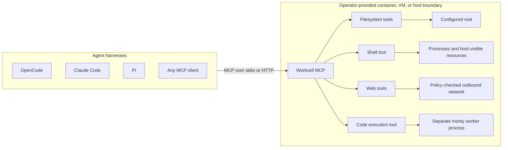
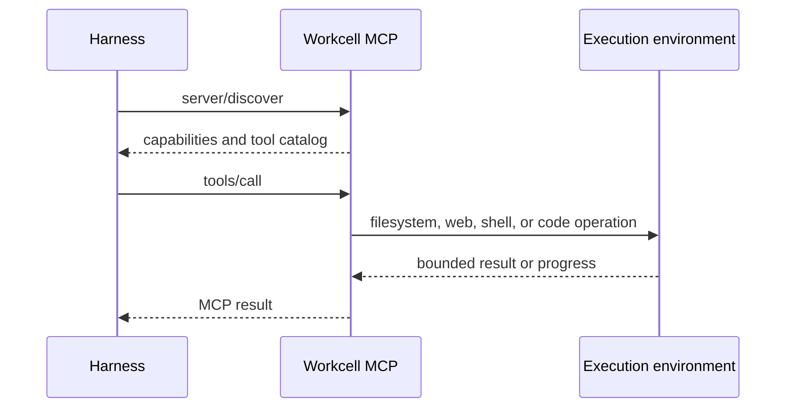
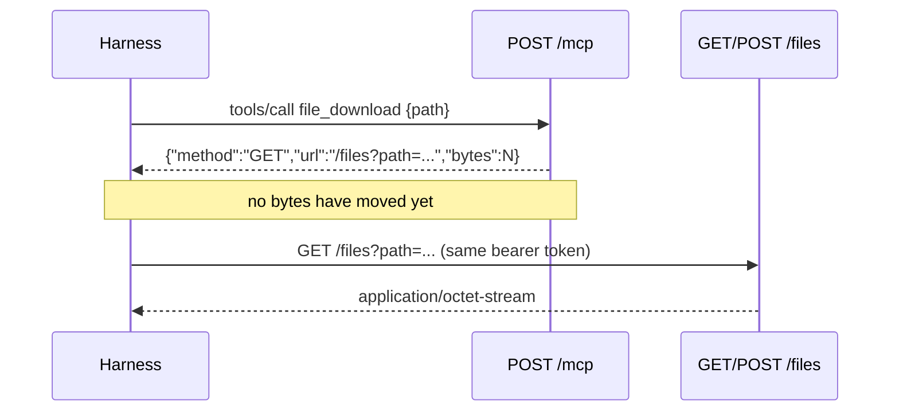
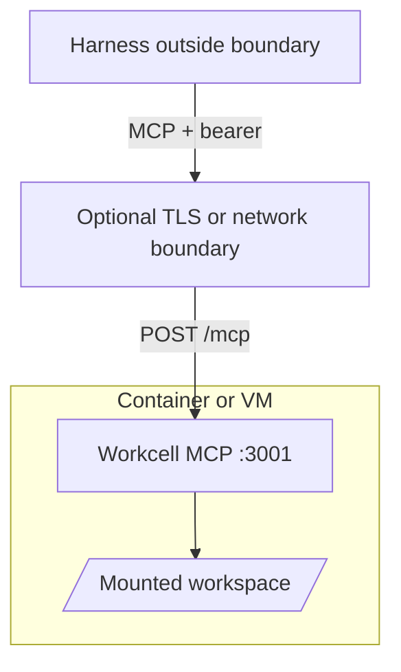

# Workcell MCP

Workcell MCP is a portable, harness-independent execution server for filesystem, web, and shell
tools. Run it directly over stdio or deploy it inside a container, VM, sandbox, or dedicated host and
connect any compatible MCP client.

Workcell owns no users, teams, workspaces, deployment records, or tenant routing. One server process
represents one execution environment; optional remote-host identifiers are opaque operator labels,
not records managed by Workcell.

> [!WARNING]
> Workcell does not create a sandbox. Its tools inherit the filesystem, process, network, and resource
> boundary of the environment in which the server runs. Put Workcell inside the isolation boundary you
> intend an agent to access.

## Architecture



The harness decides what to do. Workcell executes tool calls where it is deployed. Isolation,
resource limits, credentials, mounts, and network policy belong to the container, VM, sandbox, or
host operator.



## Tools

| Group | Tools | Notes |
| --- | --- | --- |
| Files | `file_read`, `file_glob`, `file_grep` | Root-confined, bounded reads and search. |
| Files | `file_write`, `file_edit`, `file_apply_patch` | Present in the catalog only when `--allow-write` is set. |
| Files | `file_index` | Bounded source skeletons and deterministic directory listings. |
| Code graph | `code_map`, `code_context`, `code_refs`, `code_impact`, `code_expand` | Repository-scale symbol ranking, retrieval, and impact over the same confined tree. Reference counts are floors. |
| Web | `websearch`, `webfetch` | Search defaults to credential-free Exa; fetch applies SSRF and response bounds. |
| Shell | `shell` | Applies immutable command policy, then executes with ordered progress and a cleaned environment. |
| Python execution | `python_execution` | Runs a Python snippet in a separate worker process with no filesystem, network, or environment access. |
| Transfer | `file_download`, `file_upload` | HTTP transport only. Prepares a byte transfer over `/files`; `file_upload` needs `--allow-write`. |
| Server | `execution_environment` | Returns fresh sanitized platform, privilege, package-manager, and command observations. |

All groups except transfer are enabled by default. Use repeatable
`--tool-group files|code_graph|web|shell|python_execution|transfer` arguments to expose a subset.
Files, code graph, shell, and transfer require a positional root. Transfer additionally requires
`--transport http`, because its tools mint URLs for a route only the HTTP transport serves;
requesting it over stdio is a startup error.

The filesystem tools enforce a canonical root. The shell tool uses that root as its initial working
directory, but shell commands can deliberately access any path, network, or process visible inside the
deployment environment.

Shell execution is denied by default. Configure `--shell-policy` for explicit allow/deny rules, or use
`--yolo` inside an appropriate isolation boundary to permit unmatched commands. Explicit policy denies
still win under `--yolo`.

The `python_execution` tool is unrelated to the shell policy. It evaluates a snippet in a `monty` worker process
that has no filesystem, no network, no subprocesses, and an empty environment, so it needs no root
and no policy. It is for computation, not for reaching the host. It requires the `monty` worker
binary, which is installed from a pinned release rather than built with the workspace. Workcell
release/install builds embed it, the container ships it beside the server, and source builds produce
it with `make code-worker`. An explicit `--code-worker` is authoritative; otherwise discovery checks
beside the server, then the embedded worker, then `PATH`. When no worker is available, startup fails
rather than exposing a tool that cannot run.

## Requirements

- Rust 1.98 for source builds
- The `python_execution` tool group needs the pinned `monty` worker binary: `make code-worker`
- Linux is the primary production target
- Bash is required for the shell tool in the production container

## Quick Start

Build and run all tools over stdio:

```bash
cargo build --release --locked
./target/release/workcell-mcp \
  --allow-write \
  --shell-policy shell-policy.example.toml \
  /absolute/workspace/root
```

Run only web tools; no filesystem root is required:

```bash
workcell-mcp --tool-group web
```

Run loopback HTTP on port 3001:

```bash
workcell-mcp --transport http --port 3001 --allow-write /absolute/workspace/root
```

The only HTTP MCP endpoint is `POST /mcp`. HTTP is stateless and emits one readiness JSON line on
stdout after binding. Enabling the transfer group adds exactly one further route, `GET|POST /files`,
which moves raw bytes rather than JSON-RPC. It is absent unless that group is enabled.

### File Transfer

MCP results are bounded at tens of kilobytes, so a real file cannot be base64-encoded through a tool
result. Transfer therefore splits the operation: the tool authorizes a path and returns a URL, and the
harness moves the bytes.



`url` is relative because only the harness knows the externally reachable origin, which may differ
from the bind address behind a proxy or port mapping. The URL carries no signature and is not a
capability: `/files` re-resolves and re-authorizes the path on every request, so it grants nothing the
caller's existing credentials did not already grant. Uploads must send
`Content-Type: application/octet-stream`, are bounded by `--max-transfer-bytes` (default 64 MiB), and
are published by an atomic rename, so an interrupted transfer never leaves a truncated file.

## Client Configuration

For clients that launch stdio servers, configure the binary and root directly. The exact configuration
file differs by client, but the MCP server entry has this shape:

```json
{
  "mcpServers": {
    "workcell": {
      "command": "/absolute/path/to/workcell-mcp",
      "args": [
        "--allow-write",
        "--shell-policy",
        "/absolute/path/to/shell-policy.toml",
        "/absolute/workspace/root"
      ]
    }
  }
}
```

For detached HTTP deployments, configure the client with the server's `/mcp` URL and, when enabled,
an `Authorization: Bearer ...` header.

## Isolated Deployment

Build the image:

```bash
docker build -t workcell-mcp:local .
```

Generate a bearer token and run a hardened container:

```bash
export WORKCELL_MCP_HTTP_TOKEN="$(openssl rand -hex 32)"

docker run --rm \
  --read-only \
  --cap-drop ALL \
  --security-opt no-new-privileges \
  --pids-limit 128 \
  --tmpfs /tmp:rw,noexec,nosuid,size=16777216 \
  --mount type=bind,src=/absolute/workspace/root,dst=/workspace \
  --publish 127.0.0.1:3001:3001 \
  --env WORKCELL_MCP_HTTP_TOKEN \
  workcell-mcp:local \
  --transport http \
  --http-bind container \
  --allow-write \
  /workspace
```

Container bind listens on `0.0.0.0` and therefore requires a bearer token of at least 32 bytes.
Loopback HTTP may run without authentication. Workcell provides no TLS; terminate TLS and apply
network policy outside the process when crossing a trusted local boundary.

## Shell Policy

Shell policy is immutable process configuration loaded from a bounded regular TOML file. Workcell uses
tree-sitter Bash parsing to extract each command scope before process creation. Denies are evaluated
first across the complete request, so `git diff && rm -rf /` cannot partially run when `rm *` is denied.

```toml
version = 1
default = "deny"
allow = ["cargo *", "git diff*", "git status"]
deny = ["rm *", "git push*"]
```

Patterns are exact strings or prefix globs with a single trailing `*`. Unmatched scopes use `default`,
which is `deny` when omitted. `--yolo` or `WORKCELL_MCP_YOLO=true` permits unmatched scopes while
preserving explicit denies. `WORKCELL_MCP_SHELL_POLICY` is the environment equivalent of
`--shell-policy`. See [`shell-policy.example.toml`](shell-policy.example.toml).

Malformed or opaque shell syntax is denied by default. `--yolo` admits fully classified unmatched
scopes. It admits opaque syntax only when no deny rules are configured; otherwise Workcell cannot prove
that a hidden executable does not match a deny and fails closed. This parser is a policy aid, not a
sandbox: wrappers, interpreters, aliases, functions, dynamic expansion, and allowed programs can
execute behavior not visible as a direct syntax-tree command. Keep OS isolation and egress controls.

> [!CAUTION]
> Shell policy is best-effort syntactic policy, not complete behavioral enforcement. An MCP client or
> LLM agent can use writable file tools when `--allow-write` is enabled, or an allowed shell command,
> to create a Bash, JavaScript, Python, Perl, or other script and then execute it through an allowed
> interpreter. Workcell authorizes the visible invocation such as `python script.py`; it does not parse
> or authorize the script's contents. Likewise, denying `rm *` does not prevent an allowed Python or
> Node.js process from deleting files. Use a container, VM, sandbox, filesystem permissions, and network
> policy as the actual security boundary.

Admission failures are returned as MCP tool errors with an actionable message for the harness. The
message identifies the generalized scope when available, explains whether an allow or deny rule
blocked execution, and states that only the Workcell operator can change immutable policy. Oversized
commands report the actual UTF-8 byte count and the 65536-byte limit. MCP commands are JSON strings, so
malformed JSON or non-UTF-8 payloads are rejected by the transport before shell dispatch.



## HTTP Security

- `--http-bind loopback` binds `127.0.0.1` and permits unauthenticated local use.
- `--http-bind container` binds `0.0.0.0` and fails startup without authentication.
- `WORKCELL_MCP_HTTP_TOKEN` supplies a direct process-level bearer.
- `--http-token-file` or `WORKCELL_MCP_HTTP_TOKEN_FILE` reads the bearer from a regular bounded file.
- `--allowed-host` or `WORKCELL_MCP_ALLOWED_HOSTS` controls accepted HTTP host authorities.
- `--max-transfer-bytes` or `WORKCELL_MCP_MAX_TRANSFER_BYTES` bounds a single `/files` transfer in
  either direction. It applies only with the transfer group and is independent of the `POST /mcp`
  JSON body bound.
- Browser `Origin` headers, unknown routes, and methods the route does not admit are rejected. On
  `/mcp` that means POST only, with invalid JSON and bodies over 12 MiB rejected; on `/files` it means
  GET and POST only, with bodies streamed rather than buffered and bounded by `--max-transfer-bytes`.
- Authentication is identical on both routes. `/files` is not reachable without the same bearer token
  `POST /mcp` requires, and a minted transfer URL carries no independent authority.
- There are no lease, user, tenant, administration, or dynamic configuration endpoints.

Token files and `WORKCELL_MCP_HTTP_TOKEN` are mutually exclusive. Prefer a mounted secret file where
the deployment platform supports one.

### Remote-host discovery

Authenticated HTTP deployments may opt into `ai.workcell/remote-host` discovery by configuring all
five identifiers: `--remote-server-id`, `--remote-workspace-id`,
`--remote-workspace-generation`, `--remote-root-project-id`, and `--remote-principal-id`, or their
`WORKCELL_MCP_REMOTE_*` environment equivalents. The generation is a stable operator value that must
change when the workspace is replaced or reset; it is distinct from the random per-process instance
identifier. The client must request version `v1` in `server/discover`. Workcell then reports those
opaque identifiers, the process instance identifier, the frozen catalog and policy revisions, the disclosed startup
execution-environment revision (or a stable nondisclosure revision), exact enabled protocol
capabilities and limits, and an opaque current-directory handle with a root-relative display path.

This extension uses the existing `POST /mcp` JSON-RPC path. It is absent over stdio, from
unauthenticated HTTP servers, when not configured, and when the client does not request it. One
configured root is one project and one bearer-authenticated server process represents one principal.
Durable workspace, client-session, and resource identity is the tuple of server ID, workspace ID,
workspace generation, resource namespace version, root-project ID, and principal ID. Resource IDs
must not be interpreted outside that tuple. The process instance ID is not part of durable identity;
it detects loss of volatile operation-ledger and watch state after restart. Every binding comparison
rejects a workspace-generation mismatch.
Negotiated clients may call `ai.workcell/prepare`, `ai.workcell/execute`, `ai.workcell/release`,
`ai.workcell/status`, and `ai.workcell/cancel` on that same path. Preparation validates the frozen
tool contract and host binding, resolves bounded resource intents without running the tool, and
returns an expiring preparation ID. Execution accepts only that ID plus one invocation ID. The first
request performs the operation; retries with the same invocation ID return the retained structured
result instead of repeating an effect. A different invocation ID is rejected. The operations
descriptor reports `exactPreparation: true`: execution consumes the typed prepared value and rejects
resource, working-directory, content, configuration, catalog, or policy changes that invalidate it.
Websearch preparation reports the provider connection separately from a search resource whose opaque
ID and bounded display text bind the exact normalized query used by embedded permission checks.

The same negotiated extension exposes versioned workspace methods for directory resolution, stat,
deterministically ordered list and traversal, bounded text ranges, and deterministic text search:
`ai.workcell/resolve-directory`, `ai.workcell/stat`, `ai.workcell/list`,
`ai.workcell/read-text`, and `ai.workcell/search-text`. Every relative request carries both the exact
host binding and an immutable cwd handle. Directory resolution returns a fresh handle plus a
root-relative POSIX display path; traversal or symlinks cannot leave the one configured root-project.
List and search pagination use bounded opaque server-side cursors bound to the request digest and
observed resource revision. Unknown or modified cursors are rejected, and a resource change returns
an explicit stale-cursor error. List traversal retains at most 50,000 entries and 16 MiB of entry and
path state and hashes at most 64 MiB of file content, independently of the requested page size;
`truncated` is explicit when one of those aggregate limits stops the traversal. Search responses
preserve the underlying scan's `filesScanned`,
`filesListed`, and `truncated` values, so a null cursor does not claim completeness when the bounded
scan stopped early. Match text and its resource revision come from one metadata-verified file
snapshot; a concurrent replacement is omitted rather than pairing old text with a newer revision.
Text reads return the resource revision used by prepared writes. `byteOffset`
continues within the selected line range; `startByte`, exclusive `endByte`, and `nextByteOffset`
identify the exact returned bytes. `startLine` identifies the line containing the first returned byte,
while `endLine` identifies the last line completed by that chunk and is zero when none was completed.
Empty and beyond-EOF reads report no completed line instead of inventing one.

`ai.workcell/watch-open`, `ai.workcell/watch-poll`, and `ai.workcell/watch-close` provide bounded
process-local change replay without adding an HTTP route or a stateful transport session. A watch is
bound to the authenticated host, principal, root project, and immutable cwd handle. Open returns an
opaque replay cursor; poll returns monotonically sequenced `create`, `modify`, `remove`, or `rescan`
events and a cursor for the last delivered event. Cursors can be replayed while their events remain in
the advertised retention window. A modified cursor, process-instance change, backend queue overflow,
watcher error, expired subscription, or lost retention returns `fullResync` with a reason and no
continuation cursor. It never claims a complete incremental history across one of those boundaries.
Subscriptions, raw backend queues, retained events and bytes, poll batches, waits, total event count,
and lifetime are all bounded; close, overflow, backend failure, expiry, replacement, and server drop
release the native watcher and abort its expiry task.

Native filesystems do not provide one portable exact rename contract. Workcell therefore advertises
`exactRenamePairing: false` and normalizes what the backend can establish into remove/create events.
An ambiguous rename is a `rescan` event rather than a fabricated pair. Event paths use the same
root-relative POSIX form and protected-path exclusions as workspace traversal; absolute host paths are
never returned. Both external filesystem changes and mutations performed through Workcell enter this
same stream.

`ai.workcell/discover-project-assets` and `ai.workcell/read-project-asset` expose the fixed
`project-assets.v1` manifest. Its allowlist is deliberately source-shaped rather than configuration-
shaped: recognized instruction basenames (`AGENTS.md`, `AGENTS.local.md`, `CLAUDE.md`, `COPILOT.md`,
`.cursorrules`, `.windsurfrules`, `.clinerules`, `CONVENTIONS.md`, `GEMINI.md`, and
`CODING_AGENT.md`), `.github/copilot-instructions.md`, `.caudra/instructions`, one-level `SKILL.md`
sources below `.caudra/skills`, `.claude/skills`, `.opencode/skills`, or `.agents/skills`, and
`.caudra/workflows/*.rhai`. It also includes immediate Markdown files under exactly
`.caudra/commands`, `.claude/commands`, and `.opencode/commands`, plus the exact declarative permission
source `.caudra/permissions.toml`. Command, skill, and instruction sources are marked `declarative`.
Workflow scripts are marked `clientApprovalRequired`. Permissions are marked `mixedReviewRequired`:
a client may apply denies immediately, but must review allows and bind that decision to the returned
revision. Workcell does not parse or apply any of these sources.

Discovery retains at most 256 assets, visits at most 50,000 entries, retains at most 16 MiB of path
state, and hashes at most 64 MiB of content; it rejects a partial traversal. Asset paths are at most
4,096 bytes and each UTF-8 read is at most 64 KiB. Reads reuse confined stat, require the discovered
content revision, and return source bytes without parsing or executing them.

The manifest does not include `.env`, `init.lua`, MCP configuration, plugin configuration or source,
general `.caudra` configuration, arbitrary scripts, or arbitrary remote configuration. It follows no
symlinks and has no fallback glob or project-provided manifest that can widen this list.

`ai.workcell/prepare-mutation` prepares a bounded batch of explicit create, revision-matched write,
mkdir, revision-matched rename, and revision-matched delete actions. It discloses every source and
destination before execution and enters the same operation ledger as ordinary exact tool preparation;
there is no second ledger. Each publication uses the narrowest atomic filesystem primitive available.
Rename and delete revisions are computed from regular-file bytes and therefore support binary files;
UTF-8 and binary-content checks remain required for text writes and edits.
There is no portable atomic transaction across arbitrary files, so discovery reports
`atomicAcrossFiles: false`: all resources are revalidated before the first publication, and an
in-process failure or cancellation rolls completed actions back in reverse order. A failed rollback is
reported as `partial_failure`. A process or host crash between publications or during rollback can
leave a partial batch; recovery is an operator filesystem concern rather than a claim of atomicity.

`ai.workcell/prepare-exec` prepares direct non-interactive execution against an immutable cwd and
bounded command/timeout options. It passes through the same startup-frozen shell parser and policy as
the ordinary `shell` tool, then uses the common execute/status/progress/cancel lifecycle. It is absent
when shell is disabled and has no input field that can approve or bypass policy. Cancellation before
dispatch is a clean `cancelled` outcome with `sideEffectsPossible: false`. Once a direct child,
file, workspace, or SCM mutation, snapshot restore or unrevert, or snapshot cleanup may have started, a
failed or cancelled operation reports `sideEffectsPossible: true` and status is `indeterminate`
unless a pre-effect rejection or successful atomic rollback proves otherwise. Killing a process
cannot prove that its earlier effects were absent. Prepared-operation bytes remain charged to the
global ledger while execution is running, including time queued on a mutation lock.

The versioned SCM slice uses `ai.workcell/scm-discover`, `ai.workcell/scm-status`,
`ai.workcell/scm-log`, `ai.workcell/scm-diff`, and `ai.workcell/scm-read-side`. Discovery starts from a
confined immutable cwd/resource handle and returns an opaque repository handle only for an ordinary
worktree and `.git` directory that both remain inside the configured root. Linked worktrees,
submodules, symlinked or external git directories, bare repositories, and configured external filter
or diff/textconv programs are rejected. Git availability and its bounded version response are probed
when the remote host is constructed; failed probes omit SCM and add `scm` to `controlPlaneMissing`.
At most four SCM operations run concurrently across all groups in one process; queued requests remain
cancellable. The effective bound is advertised as `maxConcurrentOperations`.
The regular, non-symlink `.git/config` is limited to the advertised 1 MiB `maxConfigBytes`; bounded
descriptor reads and identity revalidation bracket each in-process repository open.
Status distinguishes staged, unstaged, untracked, and conflicted paths. Log,
status, and diff ordering is deterministic; pagination cursors are request- and revision-bound. Log
walks at most 10,000 prior commits and 16 MiB of aggregate commit objects, advertised as
`maxLogScanBytes`, charging object-header sizes before loading each body and including commits skipped
to reach a cursor. It rejects any commit object over 1 MiB before loading or decoding it and retains
only the current page plus one lookahead commit. Diff
scans at most 16 MiB and parses at most 20,000 aggregate lines across at most 500 files before
materializing a bounded prefix. Log and diff responses report `truncated` when an aggregate limit
withholds the tail; diff and side reads also enforce their advertised response line and byte limits.

`ai.workcell/scm-prepare-mutation` prepares an exact `stage`, `unstage`, or `discard` set of at most
127 paths, leaving one of the operation ledger's 128 resource intents for the repository itself, and
returns its status preview plus repository identity and HEAD, index, and worktree revisions. Execution
uses the common operation ledger, acquires the filesystem mutation lock, revalidates every captured
revision, and returns a structured stale or lock error instead of guessing through concurrent index
changes. Same-invocation retries return the retained result. Discard accepts tracked worktree changes
only and never removes an untracked path; no clean/reset or generic Git execution method is exposed.
Repository and history decoding use `gix`. The few Git CLI operations use fixed argument templates,
bounded documented porcelain/name-status or parsed patch data, discard stderr, and never return raw
terminal output. Every diff pass disables external diff, text conversion, and color. Helper-affecting
environment variables are removed; repository filters and diff-driver configuration are rejected;
hooks and filesystem monitors are disabled for those calls.

Workspace snapshots are disabled unless an authenticated remote host, writable files group, and an
existing operator-owned private directory are configured together with `--snapshot-root` or
`WORKCELL_MCP_SNAPSHOT_ROOT`. The directory must be absolute, owned by the process identity, inaccessible
to group and other users on Unix, free of symlink components, and disjoint from the exposed workspace.
It has no shared temporary-directory default. Snapshot blobs, manifests, checkpoint mappings, and
restore journals remain beneath a directory keyed by the complete durable workspace identity under
that private root. They never cross workspace generations and are never returned as byte payloads or
exposed by an HTTP route.

`ai.workcell/snapshot-capture` uses a client checkpoint ID for durable idempotency. It captures at most
128 confined regular files, 64 MiB per file, and 256 MiB total while holding the filesystem mutation
lock. Each scan admits at most 50,000 directory entries and 16 MiB of aggregate retained path bytes,
including directories that contain no files, before repeating the scan and publishing the manifest. A
concurrent change fails capture instead of publishing a mixed manifest. Symlinks and special files are
rejected rather than followed. The
filesystem policy's protected paths, including Git metadata, credentials, and `.workcell`, are excluded;
an in-workspace code-worker cache is also recorded as an exclusion even when its final path does not
exist yet. Immutable blobs are SHA-256 addressed and deduplicated. Every blob, manifest, checkpoint,
and journal publication checks the prospective replacement-aware total while holding the publication
lock. A failed capture runs bounded orphan collection. Manifests record root-relative path, resource
identity, revision, digest, mode, and size. `snapshot-inspect` pages that bounded manifest and verifies
both manifest identity and every referenced blob before returning metadata.

`snapshot-prepare-restore` allocates the stable restore ID and deterministic pre-restore snapshot ID,
and returns the complete create, replace, delete, conflict, and missing-ancestor preview before storing
the prepared value in the common operation ledger. Authorization includes one aggregate private-store
manifest-and-blob write intent in addition to workspace and journal effects. Execution revalidates the
captured workspace revision before any effect and again
compares each file immediately before publication. Later edits are never overwritten, and execution
creates only ancestor directories disclosed by preparation. Each replacement is atomic for one file,
but a portable atomic transaction across files does not exist: discovery reports
`atomicAcrossFiles: false`. Before publication, Workcell captures the exact current file state as a
private snapshot and durably writes a restore journal under the prepared restore ID. Directory and file
progress are journaled separately. A cancellation or ordinary failure reports partial or indeterminate
state; after restart, bounded journal recovery compares the workspace with pre- and post-state, resolves
an already completed restore, and otherwise requires reconciliation without replaying writes.

`snapshot-status` reads the durable restore journal. `snapshot-prepare-unrevert` restores the private
pre-restore snapshot through the same preview, common-ledger execution, compare-before-write, and status
path. A completed, partial, or indeterminate restore protects its paths and referenced snapshots until
the completed state is acknowledged with `snapshot-acknowledge`; another overlapping restore is refused.
Journal count and byte quotas are checked before restore and unrevert, and pressure may reclaim only
acknowledged terminal journals. `snapshot-prepare-cleanup` is likewise a common-ledger mutation.
Preparation retains one exact plan covering checkpoint mappings, acknowledged journals, manifests, and
unreachable blobs and binds authorization to its digest. Execution revalidates that plan, removes
references before referents, and deletes no resource discovered after preparation. An empty snapshot ID
list is a GC-only request. Startup completes bounded orphan collection, including an over-quota orphan
store with no manifests, without replaying workspace writes.

Preparations, terminal outcomes, and ordered shell progress are held in a bounded in-process ledger.
Status therefore reports an instance mismatch as `indeterminate`, and a released, expired, or evicted
record as `forgotten` while its bounded tombstone remains. Restarting the process intentionally loses
the generic ledger; snapshot restore journals retain only reconciliation status and publication
progress. Every retained outcome carries `sideEffectsPossible`; an uncertain post-start cancellation
is retained as `indeterminate`, not as a clean cancellation. There are no user, tenant, ticket, signing,
lease-broker, controller, or administrative APIs.
Discovery sets `controlPlane: true` only when workspace reads, watch, project assets, writable prepared
mutation, direct exec, SCM, operations, and healthy configured snapshots are all present. Otherwise it
stays false and `controlPlaneMissing` names the absent subcapabilities. The optional `/files` byte route
is unchanged: every request still presents the process bearer and is re-resolved and reauthorized.

## Web Configuration

`websearch` uses Exa's credential-free hosted search by default; no API key is required. Search queries
are sent to Exa, a third-party provider, and are subject to its privacy terms, availability, and
anonymous rate limits. Set `WORKCELL_WEBSEARCH_BACKEND=disabled` to disable search while retaining
`webfetch`, or select another backend explicitly:

| Backend | Configuration |
| --- | --- |
| Exa MCP (default) | No configuration, or `WORKCELL_WEBSEARCH_BACKEND=exa-mcp`; no API key |
| Disabled | `WORKCELL_WEBSEARCH_BACKEND=disabled`; `webfetch` remains available |
| SearXNG | `WORKCELL_WEBSEARCH_BACKEND=searxng`, `SEARXNG_URL`, and at most one supported credential mode |
| Exa direct API | `WORKCELL_WEBSEARCH_BACKEND=exa`, `EXA_API_KEY` |
| Brave | `WORKCELL_WEBSEARCH_BACKEND=brave`, `BRAVE_API_KEY` |
| Kagi | `WORKCELL_WEBSEARCH_BACKEND=kagi`, `KAGI_API_KEY` |
| SerpApi | `WORKCELL_WEBSEARCH_BACKEND=serpapi`, `SERPAPI_API_KEY`, `SERPAPI_ENGINE=google|bing` |

Source-icon resolution is disabled by default for both `websearch` and `webfetch`. Enable it with
`--web-icons` or `WORKCELL_WEB_ICONS=true`. Opting in may issue additional requests to result/page
origins and embeds verified `iconUrl` and `iconDataUrl` fields in structured output.

### Outbound proxy

Web tools honor the conventional proxy environment, so a sandbox that permits egress only through an
enforcing proxy needs no Workcell-specific configuration. Every outbound path is covered: `webfetch`,
every `websearch` backend, and source icons.

| Setting | Effect |
| --- | --- |
| `HTTPS_PROXY`, `HTTP_PROXY`, `ALL_PROXY` | Per-scheme proxy; the per-scheme value wins over `ALL_PROXY`, and uppercase wins over lowercase |
| `NO_PROXY` | Comma-separated bypass list: `*`, domains and their subdomains, IP literals, and `10.0.0.0/8`-style blocks |
| `WORKCELL_MCP_HTTP_PROXY`, `WORKCELL_MCP_NO_PROXY` | Workcell-specific values that override the ambient environment |
| `--http-proxy`, `--no-proxy` | Flags that override every variable |
| `--no-http-proxy` | Ignore all of the above and dial directly |

The `shell` tool forwards the conventional variables, in both cases, to every command it runs, so
`curl`, `git`, `pip`, and `npm` reach the same proxy with no extra setup. Forwarding is verbatim,
credentials included. The Workcell-specific settings and the flags are not forwarded and do not strip
an ambient value: they select the proxy for Workcell's own web tools only, so `--no-http-proxy` makes
`webfetch` dial directly while a shell command still sees the environment it was given.

Values are read once at startup, so a shell command cannot change the selection: it alters only its
own children's environment. A malformed proxy value stops startup rather than falling back to a
direct dial, because under enforcement that fallback would look like an egress bypass. Only `http`
and `https` proxies are supported; `socks5` is rejected explicitly.

A proxied request is not resolved locally. Workcell still rejects non-HTTP schemes, URL credentials,
`localhost` and other special-use names, and non-public IP literals before contacting the proxy, but
the address decision for a hostname — including DNS rebinding defense — belongs to the proxy. Use one
that re-checks the resolved address before dialling. Hosts matched by a bypass rule keep the full
direct path, including resolution and connector pinning.

TLS is verified through the platform verifier, so an intercepting proxy needs its CA in the
container's trust store. Without interception, a proxy sees only `CONNECT host:443` for HTTPS
targets and never a search provider's API key.

Use `--env-file path/to/server.env` to load defaults. Configuration precedence is CLI, process
environment, selected dotenv file, then built-in defaults. Secret values are redacted from debug
representations and logs.

See [`example.env`](example.env) for the full environment surface.

## Protocol

Workcell implements modern MCP `2026-07-28` and an exact `2025-11-25` compatibility fallback through
the pinned Rust MCP SDK revision in `Cargo.toml`. Discovery advertises the modern revision first.
Modern-aware clients that probe with `server/discover` select it; clients that open directly with the
legacy `initialize` handshake remain on `2025-11-25` because a server cannot force them to upgrade.

Use `--modern-only` or `WORKCELL_MCP_MODERN_ONLY=true` to reject legacy initialization. The default
dual-era posture is:

| Client opening | Selected behavior |
| --- | --- |
| `server/discover` or complete per-request metadata | Stateless `2026-07-28` |
| `initialize` requesting exactly `2025-11-25` | Legacy wire format with no HTTP session state |
| Older, unknown, or legacy initialization under modern-only mode | `UnsupportedProtocolVersionError` |

- Discovery starts with `server/discover`.
- HTTP is stateless Streamable HTTP at `POST /mcp` for both versions. Workcell does not issue or accept
  `Mcp-Session-Id`; GET streams and DELETE lifecycle requests remain disabled.
- Stdio uses the SDK newline-delimited transport.
- Modern tool, discovery, and list responses use complete-result envelopes. The SDK omits modern-only
  result and caching fields for legacy peers.
- JSON-RPC failures with a stable symbolic identifier expose it as `error.data.code`.
- Every tool publishes its structured output schema and `ai.workcell/contract` metadata with explicit
  contract and result versions. The catalog is built once per server and has a deterministic content
  revision.
- Cancellation is cooperative; shell calls publish ordered progress when requested. Each progress
  notification includes a bounded, single-line standard `message` field with control and
  bidirectional formatting characters escaped, plus an `ai.workcell/tool-output-chunk` metadata
  object with the exact sequence, stream, and text.
- Tasks, OAuth, protocol-level sessions, standalone HTTP GET streams, and MCP DELETE are not advertised.

### Live shell output

The `shell` tool streams stdout and stderr through the standard MCP
[`notifications/progress`](https://modelcontextprotocol.io/specification/2026-07-28/basic/patterns/progress)
mechanism. Shell output is never written as raw data to the server's protocol stdout. A client opts
in per call by including a unique string or integer `progressToken` in the request `_meta`:

```json
{
  "jsonrpc": "2.0",
  "id": 42,
  "method": "tools/call",
  "params": {
    "name": "shell",
    "arguments": { "command": "make" },
    "_meta": {
      "progressToken": "shell-42",
      "io.modelcontextprotocol/protocolVersion": "2026-07-28",
      "io.modelcontextprotocol/clientCapabilities": {},
      "io.modelcontextprotocol/clientInfo": {
        "name": "example-client",
        "version": "1.0.0"
      }
    }
  }
}
```

Workcell then publishes each accepted output chunk before the final tool result:

```json
{
  "jsonrpc": "2.0",
  "method": "notifications/progress",
  "params": {
    "progressToken": "shell-42",
    "progress": 1,
    "message": "[stdout] compiling\\n",
    "_meta": {
      "ai.workcell/tool-output-chunk": {
        "version": 1,
        "sequence": 1,
        "stream": "stdout",
        "text": "compiling\n"
      }
    }
  }
}
```

- `progress` and `sequence` increase monotonically; the final result's `finalSequence` identifies the
  last emitted chunk.
- `message` is a bounded, single-line display fallback. Exact output remains in the namespaced
  metadata, including whether it came from stdout or stderr.
- Stdio clients receive progress as newline-delimited JSON-RPC notifications. HTTP clients receive it
  on the originating request's SSE response stream.
- Without a progress token, Workcell still drains and bounds the process pipes but returns output only
  in the final stdout/stderr tails.
- Clients must consume notifications while `tools/call` is pending and decide how to render them.
  Supporting MCP transport alone does not guarantee visible live output.
- Child programs may buffer output when connected to pipes instead of a terminal. Use program-specific
  unbuffered or line-buffered modes when immediate output matters.

### Shell Output Filtering

Build tools, test runners, and package managers spend most of their output on progress rather than
information. Workcell filters the model-facing shell rendering through a built-in rule corpus so a
successful `cargo build` returns its warnings instead of several hundred `Compiling` lines. Filtering
is on by default.

Rules match the same tree-sitter command scope that shell policy authorizes, not the raw command
string, so shell metacharacters cannot steer rule selection. A rule applies only when the command
resolves to exactly one non-opaque scope; output from a pipeline or chain belongs to more than one
program, so no rule is selected for it. The two command-independent reductions below still apply
there. A rule that would replace output with a success summary is suppressed unless the command
actually exited zero, so a failing command is never rendered as success.

The corpus covers common build, test, package-manager, and container commands, including `cargo`,
`go`, `mvn`, `git`, `npm`, `pip`, `apt`, `pytest`, `jest`, `vitest`, `tar`, `wget`, `docker build`,
`docker pull`, and `docker compose`. A command with no matching rule is returned unchanged.

Rules are scoped to the subcommands whose output is progress. A command whose output is the result
the caller asked for is left alone: `apt list`, `tar -t`, `docker compose logs`, and `docker run`
have no rule, and the container's own output is never reinterpreted.

The corpus is fixed at build time and is not operator-extensible. There is no project-local rule file,
so a rule cannot be introduced by the contents of a workspace. A command that resolves to more than
one scope, or that carries an inline environment assignment such as `FOO=bar cmd`, is opaque to scope
analysis and is never filtered.

Filtering never enlarges a result. The notice a filtered rendering carries is not free, so when a
rule strips nothing, or strips less than the notice costs, Workcell returns the complete capture
instead. A filtered rendering is therefore always smaller than the unfiltered one it replaced.

Filtering affects only the rendering:

- The structured result always carries the bounded tails and the complete byte accounting.
- `notifications/progress` chunks are streamed unfiltered as the process produces them, because
  filtering requires the whole output and an exit code.
- Filtered renderings are annotated with the stages that produced them.

Disable filtering with `--no-shell-output-filter` or `WORKCELL_MCP_SHELL_OUTPUT_FILTER=false` to
return unfiltered command output. Rules in `crates/output-filter/rules/` are vendored from
[RTK](https://github.com/rtk-ai/rtk) under Apache-2.0; rules in `crates/output-filter/rules-workcell/`
are original to this project. See `crates/output-filter/NOTICE`.

### Terminal Escape Sequences

Colour, cursor-mode changes, window titles, and hyperlinks are addressed to a terminal. A model is
not one, and the bytes cost far more than their length suggests: `\x1b[33m` is several tokens that
merge with nothing, decorating text that is often a single character.

Workcell handles them at both ends.

The child environment sets `NO_COLOR=1` and `CLICOLOR=0`, so a tool that honours the convention never
writes the bytes. These are set rather than forwarded: the shell child starts from a cleared
environment, so this is a default for an environment that has none rather than an override of an
operator's choice. An explicit `--color=always`, `-c color.ui=always`, or equivalent still wins.
Because it describes the environment a command runs in rather than how output is rendered, it is not
affected by `--no-shell-output-filter`.

What still arrives is stripped from the model-facing rendering and announced as
`[filtered: escapes]`. Like the progress collapse, this is command-independent: hardcoded colour
comes overwhelmingly from hand-written scripts and chains, for which no rule is ever selected. The
strip runs before rule selection, so a rule's patterns see clean text rather than silently missing a
coloured line. Nothing but decoration is removed — no line is dropped, joined, or reordered — and the
structured result keeps the bytes.

To read the sequences themselves, pipe through `cat -v`, `od -c`, or `sed -n l`. Those render ESC as
a printable `^[` before the filter sees it, so the request survives intact:

```
$ printf '\033[33mwarn\033[0m\n' | cat -v
^[[33mwarn^[[0m
```

### Progress Bars

A progress bar is not filtered, because it is not lines. `tqdm`, `curl`, and `dpkg` do not consult
`isatty`, so they redraw into a pipe exactly as they would into a terminal: a carriage return, a new
frame over the old one, and no newline until the end. A ten-minute training run therefore arrives as
a single row hundreds of kilobytes wide, and every line-oriented rule is defeated by it — a per-line
cap keeps the opening frame and discards the completed one.

Workcell decodes that stream into the rows a terminal would display, as the capture ring is filled:

```
Loading weights: 100%|██████████| 851/851 [07:12<00:00,  1.97it/s]
[4218 progress redraws collapsed]
```

This is decoding, not policy, so it is unconditional and is not affected by `--no-shell-output-filter`.
It applies to every command, including the ones that matter most here: a bar is usually emitted by a
training script or an ad-hoc program that no rule names.

Rendering happens on the way into the capture ring rather than on the way out. Frames from a long run
far exceed the per-stream ring, so rendering afterwards would find the frames intact and everything
printed before them evicted. Three things preserve fidelity:

- `stdoutUtf8Bytes` and `stderrUtf8Bytes` still report what the process wrote.
- `stdoutRedrawsCollapsed` and `stderrRedrawsCollapsed` report how many frames were absorbed.
- `notifications/progress` chunks are published before the ring and remain byte-exact, so a client
  that wants to render the bar itself receives every frame.

Frames that arrive one per line instead — from a logger, a CI log collector, or a container runtime
that has already converted the stream — are collapsed separately, and that reduction *is* filtering:
it is announced as `[filtered: progress]` and is disabled with `--no-shell-output-filter`. Its gates
are deliberately narrow, requiring a shared line shape, two independent progress signals, and a
counter that advances against a fixed total or a percentage. A numeric table and a run of repeated
warnings both survive it, and both are pinned by fixtures.

Clients may negotiate `ai.workcell/execution-environment` version `v1` to receive a sanitized startup
snapshot during discovery. The `execution_environment` tool returns the same descriptor shape from a
fresh bounded inspection, so clients can observe later command installation or version changes,
effective-root and non-interactive sudo status, the platform's system package manager, Git repository
state, project package-manager metadata, and recognized lockfiles without restarting Workcell.
Concurrent tool inspections are serialized.

Both surfaces report platform and container classifications, privilege observations, enabled tool
groups, workspace metadata, and command availability. Fixed command probes resolve only executable
targets outside the configured root, receive a `PATH` containing only canonical directories outside
that root, then run with fixed arguments from the executable's parent directory, a cleaned allowlisted
environment, bounded output, and short deadlines. Results never include raw root paths, environment
values, probe output, file contents, tool arguments, or credentials. Availability and privilege,
package-manager, container, sandbox, and network classifications are best-effort observations rather
than security or authorization guarantees. Disable both surfaces with
`--no-expose-execution-environment`.

## Embedding

Workcell's tool groups are usable directly from another Rust program with no MCP transport or MCP
dependency. MCP is one projection of the tool contracts, not their definition. The code group still
launches its isolated Monty worker subprocess.

The `workcell` facade is the single entry point. Each tool group is a feature, so a host compiles
only what it uses:

```toml
[dependencies]
workcell = { git = "https://github.com/tensorninja/workcell-mcp", default-features = false, features = ["files"] }
```

| Feature | Provides |
| --- | --- |
| `files` | `FileToolGroup`, `PreparedFilePatch`, filesystem schemas and bounded operations |
| `files-index` | `files` plus `file_index`, its typed output, and the feature-gated parser bundle |
| `web` | `WebToolGroup`, `PreparedWebsearch`, `PreparedWebfetch`, extraction and provider lowering |
| `shell` | `ShellToolGroup`, `PreparedShell`, scope analysis, progress streaming, and `output_filter` |
| `code` | `CodeToolGroup`, isolated interpreter execution (the `python_execution` tool) |
| `code-bundled` | `code` plus verified extraction of a build-time embedded Monty worker |
| `code-graph` | `CodeGraphToolGroup` and the five `code_*` tools over a confined source tree |
| `code-graph-git` | `code-graph` plus repository recency and churn signals through `gix` |
| `environment` | `ExecutionEnvironment` inspection |

`ToolSpec` carries the protocol-neutral contract: name, description, input and output schemas,
annotations, presentation profile, and a stable contract identity. A host registers those directly.
`files::ModelText` renders the content block a result carries, including the notice a truncated
search reports, so a host presents the same text the MCP adapter does instead of restating it.
The code-graph group renders its own through `code_graph::ModelText` and bounds its own envelope
through `code_graph::fit`, both ungated: a native host gets the same text and the same size ceiling
as an MCP client rather than reimplementing either. Its five methods take an optional
`GraphProgressSink`, which reports the crawl, parse, and rank phases with a running file count so a
host can show what a multi-second call is doing. Unlike shell progress, a dropped report cannot fail
the call.
Enabling a group's `mcp` feature additionally projects the same spec into an MCP `Tool`, which is how
the standalone server builds its catalog; without it, `rmcp` is not in the dependency graph at all.

Operations separate preparation from execution. `inspect_index`, `prepare_apply_patch`,
`ShellToolGroup::prepare`, and
the web `prepare_*` methods return a prepared value that exposes every resource the call would touch,
before anything is read, written, or executed. Hosts authorize the prepared resources under their own
policy, then commit with the matching `execute_*` method.

A shell execution returns both renderings on one value. `ShellExecution::model_text` is the filtered,
model-facing form and `ShellExecution::output` is the unfiltered capture with the complete byte
accounting. `ShellExecution::filter` names every reduction that ran, in order, along with the
unfiltered and filtered rendering sizes, so hosts do not need to parse presentation text. A host that
keeps a transcript or builds its own presentation never has to disable filtering to obtain the real
bytes. Filtering therefore changes only what a model reads, never what a host can observe.

Live output is independent of both: chunks delivered to a `ShellProgressSink` are published while the
process runs, before an exit code exists, and are byte-exact. A bar that redraws is a control stream
rather than lines, so a host that displays those chunks renders them itself with
`output_filter::RowRenderer`: `push` emits the rows a terminal would have completed, `row` shows the
one still being drawn, and `redraws` reports how many frames were absorbed. The capture already
arrives rendered, and `ShellOutput::{stdout,stderr}_redraws_collapsed` say by how much.

### Confinement is a host decision

`FileToolGroup::new` and `ShellToolGroup::with_policy` confine to a root, exactly as the standalone
server does. The `_unconfined` constructors are for hosts that own authorization themselves, and they
relax **confinement only** — every other axis stays an explicit argument:

```rust
// Inspection-only hosting: reaches anywhere the process can, but cannot mutate.
let files = FileToolGroup::new_unconfined(&base_cwd, false, None).await?;

// Host-owned shell policy with host-managed workdirs.
let shell = ShellToolGroup::with_policy_unconfined(&base_cwd, policy).await?;
```

`FileToolGroup::new_unconfined` disables root-escape rejection *and* protected-path denial together,
so `.env`, `.ssh`, `.netrc`, `*.key`, and `id_rsa` become reachable. Enumeration matches: broad
traversal reports those entries too, so a host can always discover what a call would touch. Passing
`allow_write = false` keeps that reach read-only. `ShellToolGroup::new_unconfined` relaxes workdir
resolution while leaving permission policy fail-closed.

Run `make check-native` to verify every facade feature builds with no MCP adapter linked.

`CodeConfiguration` selects an explicit external worker, a bundled-only worker with a host-provided
cache root, or discovery. Discovery checks beside the host executable, then the configured bundle,
then `PATH`. Explicit paths are authoritative and never fall back. Set
`WORKCELL_BUNDLED_MONTY_WORKER` while compiling `code-bundled` to embed a target-matching worker;
`make release` and `make install` do this automatically. The standalone cache defaults to the platform
cache directory and can be overridden with `--code-worker-cache` or
`WORKCELL_MCP_CODE_WORKER_CACHE`. Configure one explicitly when the platform cache directory cannot be
determined, and keep it owned by the Workcell process identity rather than sharing it across users.

## Development

```bash
make
```

Plain `make` runs the complete local CI pipeline. Run `make help` for focused formatting, checking,
testing, installation, local execution, and container targets. `make docker-run
ROOT=/absolute/workspace` starts the hardened HTTP topology documented above and requires
`WORKCELL_MCP_HTTP_TOKEN` in the invoking environment.

The conformance fixtures under `fixtures/mcp-conformance` are committed compatibility contracts for
tool schemas and bounded behavior. Update fixtures deliberately when a public tool contract changes.

## Project Layout

```text
src/                   Workcell host, transports, CLI, and process policy
crates/workcell/       Protocol-neutral embedding facade for native hosts
crates/tool-contract/  Protocol-neutral tool contracts shared by every group
crates/monty-worker/   Target validation, embedded worker bytes, extraction, and leases
crates/mcp-files/      Filesystem tools
crates/mcp-shell/      Shell tool and progress streaming
crates/mcp-code/       Code execution tool and worker-process supervision
crates/mcp-web/        Search, fetch, extraction, and PDF handling
crates/environment/    Execution environment inspection
crates/net/            Outbound URL, DNS, redirect, retry, and body policy
crates/source-icons/   Bounded favicon discovery and normalization
fixtures/              Cross-crate MCP conformance fixtures
```

## Tool Reference

Tool schemas are returned by `tools/list` and remain the authority for the arguments accepted by a
particular server configuration. Argument validation is repeated during dispatch rather than relying
on clients to honor those schemas. Every tool returns bounded model-facing text and, where applicable,
structured content for clients that can render richer results.

Workcell also publishes MCP tool annotations as presentation hints. Filesystem reads are read-only and
closed-world. Web search and fetch are read-only but open-world because they contact external services.
Environment inspection is non-destructive but not read-only, idempotent, or closed-world because its
sudo probe may update authentication state or invoke external policy plugins. Filesystem mutations and
shell execution are marked potentially destructive. Code execution is read-only and closed-world
because the worker cannot reach the filesystem, the network, or the host environment. These
annotations do not replace client consent, Workcell admission checks, or deployment isolation.

### Filesystem tools

In the standalone server, all filesystem paths are resolved against one canonical root. Inputs may
use root-relative paths or absolute paths inside that root. Lexical escapes, stable symlink escapes,
protected paths, and paths outside the root are rejected. Broad traversal skips symlinks, protected
entries, and directories holding regenerable build output or tool caches: `.git`, `node_modules`,
`target`, `dist`, `.venv`, `venv`, `__pycache__`, `.next`, `.nuxt`, `.svelte-kit`, `.turbo`,
`.parcel-cache`, `.gradle`, `.tox`, `.mypy_cache`, `.pytest_cache`, `.ruff_cache`, `.dart_tool`,
`.terraform`, and `.stack-work`. Dependency source trees such as `vendor`, `Pods`, `deps`, and
`third_party` are deliberately searchable, as are ambiguous names such as `build`, `bin`, and `out`
that carry real source in many projects. Skipping applies only to broad traversal: naming one of
these directories as the `path` searches inside it. Binary classification uses bounded content
inspection rather than filename extensions.

Broad traversal also applies the repository's own `.gitignore` rules, so a search spends its budget
on the tree a reader cares about rather than on generated output no fixed name list can predict.
Only per-directory `.gitignore` files inside the configured root are read. `$GIT_DIR/info/exclude` is
unreachable, because every path carrying a `.git` component is protected, and `core.excludesFile`
lives outside the root; neither is worked around, since a traversal filter is not a reason to widen
what the process can open. When a search is scoped to a subdirectory, the rules its ancestors already
imposed still apply, collected up to the enclosing repository root. The traversal root itself is
never excluded, so naming an ignored directory as the `path` searches it. `file_glob` and `file_grep`
report how many entries were excluded and whether every rule was read, because a result narrowed by
ignore rules is otherwise indistinguishable from one produced by an empty tree. `--no-gitignore` or
`WORKCELL_MCP_GITIGNORE=false` turns the whole behaviour off; it is startup configuration, and no
tool argument can negotiate it.

Pattern support covers anchoring, trailing-slash directory-only rules, `!` negation, `*`, `?`, `**`,
bracket expressions, and backslash escapes. A line that cannot be represented exactly, such as a
POSIX named class, is dropped rather than approximated, because a pattern that half-compiles hides
files its author never named. Ignore-file count, per-file size, pattern count, retained pattern
bytes, and matching work are all bounded; a bound that bites stops rule collection and is reported,
rather than leaving a partial rule set applied as though it were complete.

The traversal does not stop at a nested repository. A vendored checkout holds readable code that a
text search should find, so `file_glob` and `file_grep` descend into it. The code graph makes the
opposite choice for its own reasons; see [Code graph tools](#code-graph-tools).

Confinement is a property of the server's constructor, not of the crate. Native hosts may opt into
unconfined resolution, which disables both root confinement and protected-path denial; see
[Embedding](#embedding).

Write authority is immutable process configuration and no tool argument can negotiate it. Without
`--allow-write` the server omits `file_write`, `file_edit`, and `file_apply_patch` from `tools/list`
and does not route calls to those names, so a model is never offered a mutation that could only fail.
The three mutation schemas also reject unknown arguments, so a stale or misspelled field fails the
call instead of being silently dropped into an unintended write. Native hosts that call the group
directly are denied at the crate boundary regardless of the catalog.

The standalone defaults limit individual files and writes to 5 MiB, model-facing reads to 50 KiB,
lines to 2,000 characters, read windows to 2,000 lines, search results to 500, and broad traversal to
50,000 entries. Glob matching has an independent whole-operation work budget, sized so the heaviest
ordinary wildcard pattern can evaluate every candidate the traversal budget admits; a pathological
pattern exhausts it and truncates rather than failing. Search results are additionally fitted to the
protocol result ceiling, because one grep row can carry a full-length line. Results report truncation
when any of these bounds is reached, and `file_glob` and `file_grep` also say so in their model-facing
text. Embedders using the filesystem crate can supply stricter limits.

The optional indexer has independent defaults: 2 MiB of strict UTF-8 source, 50 KiB of model text,
2,000 bytes per output line, 1,000 returned directory entries, 10,000 scanned directory entries,
post-parse inspection limits of 200,000 syntax nodes and depth 512, two-second admission and parser
deadlines, and two process-wide parser slots. Source bytes and the parser deadline bound tree-sitter
construction work; node and depth limits are checked after construction, before extraction. These
values are host-only and never appear in model input. Native hosts enable `files-index` and pass
`IndexExecutionConfiguration` to `index_with_configuration` when a call needs a different source-size
policy.

#### `file_read`

`file_read` reads a UTF-8 text file window or lists a directory.

- `filePath` is required. An empty value is treated as `.` and reads the configured root directory.
- `offset` is an optional 1-indexed starting line. `limit` controls the maximum number of returned
  lines and defaults to 2,000.
- File output prefixes each line with `<line>: ` so later calls can request precise windows. Lines over
  2,000 characters and total model-facing output are truncated independently.
- Directory output is sorted, emits one entry per line, and appends `/` to directory names.
- Binary files, oversized files, missing paths, root escapes, and unsupported file types return tool
  errors instead of partial unlabelled content.

Use `file_glob` to discover unknown paths and `file_grep` to locate relevant sections before reading a
large file.

#### `file_glob`

`file_glob` finds files by path pattern without invoking a shell.

- `pattern` is required and supports `*`, `**`, `?`, and brace alternatives such as `*.{ts,tsx}`.
- `path` optionally narrows traversal to a directory under the configured root; omission, or an empty
  value, searches from the root.
- Matches are returned in deterministic order with relative paths, byte sizes, and line counts for
  bounded text files.
- Pattern size, brace depth, generated alternatives, matching work, traversal entries, and result count
  are all bounded. Exhausting any of them truncates the result rather than failing the call.
- `total` counts every matching file, because counting continues past the returned window. It is exact
  when `scanComplete` is true and a lower bound otherwise. A truncated result also states both numbers
  on its last line of model-facing text.

#### `file_grep`

`file_grep` searches bounded UTF-8 text files and returns matching paths, line numbers, and lines.

- `pattern` is required and uses Rust's linear-time regular-expression engine. Alternation, groups,
  character classes, anchors, and repetition are supported; look-around and backreferences are
  rejected.
- `path` optionally selects a file or directory. `include` optionally filters files with a glob such as
  `*.rs` or `*.{ts,tsx}`. An empty `path` searches from the root and an empty `include` is ignored,
  because absence already means both.
- Binary files, symlinks, and the skipped build-output directories listed above are ignored during
  broad searches.
- Regex length, file size, traversal work, match count, line length, and total output are bounded.
  Exhausting any of them truncates the result rather than failing the call.
- `filesScanned` and `filesListed` report scan coverage. An exact match total is not reported, because
  producing one would require reading every remaining file. A truncated result states both numbers on
  its last line of model-facing text.

#### `file_write`

`file_write` creates a UTF-8 text file or replaces its complete contents.

- `filePath` and `content` are required. Existing files should normally be read first so an intentional
  full replacement is reviewable.
- The result carries a bounded unified diff of the change that was applied.
- Missing parent directories are created before the write, so a path several levels deep needs no
  preparation. The created chain is subject to the same root confinement and protected-path denial as
  the target, and is created only after the write-authority check.
- Writes use an exclusive same-directory temporary file and atomic rename. Existing mode bits are
  preserved, while new files use mode `0600` on supported platforms. Created directories take the
  process umask.

#### `file_edit`

`file_edit` performs exact text replacement without requiring a whole-file rewrite.

- `filePath`, `oldString`, and `newString` are required.
- By default, the edit fails if `oldString` is absent or appears more than once. Set `replaceAll: true`
  only when replacing every exact occurrence is intentional.
- The result carries a bounded unified diff with one hunk per replacement site, so a `replaceAll`
  across a large file reports the sites rather than the span between them.
- Workcell revalidates source identity and content before publication, then uses the same atomic
  same-directory replacement path as `file_write`.

#### `file_apply_patch`

`file_apply_patch` applies a reviewable, file-oriented patch envelope containing add, update, move, or
delete sections.

- `patchText` must begin with `*** Begin Patch`, end with `*** End Patch`, and include an action header
  for every file.
- Add-file content uses `+` lines. Update sections use contextual hunks and may include
  `*** Move to:`. Delete sections remove an existing file.
- The reported diff is rendered from the sections the patch declares, so it costs the change rather
  than the distance between the first and last change in a file. `additions` and `deletions` count
  the lines that actually differ.
- The complete patch is validated and its result fitted to the MCP size ceiling before the first file
  is published. Per-file previews share one byte allowance and are shortened together, so a receipt
  too large to report never withholds the change. Only a receipt that cannot fit with no preview at
  all fails, and nothing is published when it does.
- Patch text, section count, file sizes, plan memory, diffs, and final MCP output are independently
  bounded. Source files are revalidated before publication.
- A multi-file patch is validated as a unit but is not transactional after publication starts. A later
  operating-system I/O failure can leave earlier sections applied.

#### `file_index`

`file_index` accepts one required `path` and returns either a source skeleton or a directory listing.

- Root-relative and absolute paths use the same confined or unconfined policy as every file tool.
- File output includes the canonical path, detected language, compact skeleton, semantic metadata and
  source range for each output line, source line count, parse-recovery status, and truncation status.
- Directory output is deterministic, puts directories before files, appends `/` to directory names,
  and includes typed entries, total count, listing text, and truncation status. `totalCount` is exact
  when `truncated` is false and is a lower bound on processed visible entries when `truncated` is true.
  It does not add or hide harness-specific instruction files.
- Supported families are Rust, Python, TypeScript/JavaScript, Gleam, Go, HTML, Java, C/C++/C#, Ruby,
  PHP, Swift, Kotlin, Scala, Bash, Lua, Elixir, Markdown, Bazel/Starlark, Zig, Nix, Dart, TOML, YAML,
  SQL, CSS, JSON, HCL, Containerfile, and Make.
- Extraction and formatting are native Rust visitors over tree-sitter nodes. The index feature does
  not embed a scripting runtime or load extractor code at runtime.
- MCP model text is the bare skeleton or listing. `structuredContent` carries the same bounded output;
  complete trailing rows are removed when their duplicated serialized representation would exceed the
  protocol result ceiling.
- Parsing runs in `spawn_blocking` under a process-wide semaphore. Admission, queueing, parsing,
  extraction, and formatting honor cancellation and wall-time limits. Source bytes bound parser input;
  node and depth limits apply to post-parse inspection and do not impose a tree-construction memory
  ceiling.

### Web tools

Both web tools are read-only from Workcell's perspective but communicate with an open world. Requests
can be observed by destination services, consume provider quotas, and return content that changes
between otherwise identical calls. Workcell applies network and output policy; it does not make remote
content trustworthy.

#### `websearch`

`websearch` discovers candidate pages through the operator-selected provider.

- `query` is always required. The remaining schema is provider-specific and is visible through
  `tools/list`; parameters from one backend are rejected by another backend.
- Credential-free Exa MCP is the default. SearXNG, direct Exa, Brave, Kagi, SerpApi Google, and SerpApi
  Bing are available through immutable process configuration.
- Search queries leave the Workcell process and are governed by the selected provider's privacy,
  billing, rate-limit, and availability terms.
- Results are URL-validated, normalized, deduplicated, count-bounded, field-bounded, and limited to
  50 KiB of model-facing text. Structured output carries the canonical result array without duplicating
  the formatted list.
- Provider errors are normalized into bounded, actionable results without forwarding credentials or
  arbitrary remote error bodies.
- If search is disabled or misconfigured, the tool remains callable and returns safe configuration
  guidance without issuing a search request.
- Source icons are omitted by default. With `--web-icons`, best-effort icon enrichment may issue
  additional requests to result origins and adds verified `iconUrl` and `iconDataUrl` fields.

Use `websearch` for discovery, then pass only the most relevant result URLs to `webfetch` for full-page
content.

#### `webfetch`

`webfetch` performs a bounded HTTP GET and converts a page or PDF into model-facing content.

- `url` is required and must use HTTP or HTTPS. Public HTTP input is upgraded to HTTPS before the
  request. Every resolved address and up to five redirect targets are checked against outbound URL,
  DNS, and SSRF policy. Under a configured proxy the hostname is resolved by the proxy instead, and
  the URL, scheme, credential, special-use-name, and IP-literal checks still run locally.
- `format` accepts `markdown`, `text`, or `html` and defaults to `markdown`. For HTML pages, Markdown and
  text modes use readability-oriented extraction and remove scripts, styles, iframes, and framework
  payloads. HTML mode returns bounded raw HTML while still deriving safe title and extraction metadata.
- `timeout` is one total network-and-primary-parsing deadline in seconds. It defaults to 30 and is
  capped at 60. Optional icon decoration is skipped when that deadline is exhausted.
- General response bodies are capped at 5 MiB. Model-facing output is independently capped at 2,000
  lines and 50 KiB. Structured output records the requested URL, final URL, status, content type,
  selected format, title, extraction method, low-signal indicator, and truncation state when available.
- Unsupported non-text content returns an error instead of being decoded as text. JSON, XML,
  JavaScript, XHTML, and other textual media types are returned as bounded text.

PDF responses have a separate 6 MiB transfer ceiling and support two explicit modes:

- `pdfMode: "extract"` is the default. Workcell verifies the PDF signature, rejects documents over 200
  pages or other structural limits, bounds extracted text to 2 MiB, normalizes page text, and then
  applies the normal 2,000-line and 50 KiB model-output limits. The structured result reports
  `pdfMode: "extract"` and whether transfer, parser, or output bounds truncated the result.
- `pdfMode: "attachment"` skips text extraction and returns the complete bounded PDF as an
  `application/pdf` data-URL attachment. The filename is URL-decoded, stripped of traversal and control
  characters, and byte-bounded. Workcell never emits a partial attachment: a truncated or oversized
  PDF is rejected.
- Responses declared as PDF, and eligible binary responses, must begin with `%PDF-`; mislabeled binary
  content is rejected. Parse failures return a bounded error rather than raw parser diagnostics.
- HTML and PDF parsing run in bounded in-process blocking jobs. This limits concurrent parser work but
  is not hard CPU or memory containment; deploy Workcell inside a resource-limited process, container,
  or VM when parsing untrusted documents.

With `--web-icons`, `webfetch` may also resolve a verified source icon. Already-fetched HTML is reused
where possible so icon discovery does not refetch the page body.

### `code_map`, `code_context`, `code_refs`, `code_impact`, `code_expand`

The code-graph group answers five questions from one graph built over the configured root. It reads
through the same confined resolver the filesystem tools use and never opens a path itself.

| Tool | Answers |
| --- | --- |
| `code_map` | orient: what are the important symbols here |
| `code_context` | what should I read before making this change |
| `code_refs` | what references this, or what does this reference |
| `code_impact` | what breaks if I change this, and what tests cover it |
| `code_expand` | show me this symbol and what sits next to it |

- Importance is personalized PageRank over a call graph recovered from source text by name.
  `code_context` fuses that with a BM25 lexical lane, and reports which lane its router picked and
  why.
- **Every reference count is a floor.** Dynamic dispatch, callbacks, function pointers, trait objects,
  reflection, and macro-generated call sites contribute no edge at all, so a count of 0 means none was
  found, never that none exists. The result says so in a field rather than only in the description.
- An unknown symbol is refused with did-you-mean candidates rather than answered with zero. A symbol
  that exists and has no callers returns zero. A name matching several definitions returns their union
  and marks itself ambiguous instead of silently picking one.
- `confidence` on `code_context` is derived from how far the top result separates from the rest. It
  measures separation, never correctness, and a single result is always low.
- `path` scopes any of them to a subdirectory. Absent, or empty, means the whole configured root.
- **A map does not cross a repository boundary its root is inside.** Ranking is global and normalized,
  so a vendored checkout's symbols compete with the project's in one rank vector and can dominate the
  top of a map, and its files spend a crawl budget sized for the project that was asked about. A
  directory holding a `.git` entry — a nested clone, a submodule, or a linked worktree, since the
  entry is a file for the latter two — is therefore not descended into. The boundary is recognized
  from the directory's own entries, which the scan already produced, so detection costs no syscall of
  its own. Every pruned repository is named in the result, root-relative: passing one as `path` maps
  it on its own terms. If the configured root is not itself inside a repository there is no boundary
  to respect, and the crawl descends normally, which is what keeps a root that merely holds a
  checkout from mapping to nothing. `file_glob` and `file_grep` make the opposite choice and keep
  descending, because a text search is not distorted by a foreign tree.
- The crawl honours `.gitignore` on the same terms as the filesystem tools, and reports how many
  files were excluded. Incomplete ignore rules are named in `truncatedBy` as `gitignore_rules`,
  separately from a truncated scan: incomplete rules make the map a superset of the intended one,
  while a truncated scan makes it a subset, and those are different claims.
- Crawling, parsing, ranking, extraction worker count, and result size are bounded by host-only
  policy. A bound that fires is named in the result. Results are fitted to a 64,000-byte envelope by
  binary search over retained rows, measured on the serialized envelope rather than estimated.
- Ranking is deterministic: ids come from sorted paths, ties break on a total order, and worker count
  is invisible in the output.

### `shell`

`shell` executes one Bash command in the Workcell execution environment.

- `command` is required, limited to 65,536 UTF-8 bytes, parsed for immutable deny-first policy, and run
  as `bash -lc` on Unix. Unknown fields and empty commands are rejected.
- `workdir` selects the initial directory and defaults to `.`. It must resolve inside the configured
  root. Only that initial directory is root-confined; the command can subsequently reach any path,
  process, or network destination visible to the server process.
- `timeout` is measured in milliseconds, defaults to 120,000, and is capped at 600,000.
- Shell execution is denied unless admitted by `--shell-policy` or `--yolo`. Explicit deny rules always
  win. Policy inspects command syntax but cannot infer the behavior of scripts, interpreters, wrappers,
  or allowed programs.
- The child receives a cleaned allowlist of environment variables rather than the complete Workcell
  environment. The allowlist covers `PATH`, home, locale, temporary-directory, and the conventional
  proxy variables, so a credentialed proxy URL is readable by any admitted command. Standard input is
  closed; stdout and stderr are captured separately.
- With an MCP progress token, decoded stdout and stderr chunks are sent as ordered
  `notifications/progress` messages before the final result. Without a token, output is still drained
  safely and only bounded tails are returned.
- The final structured result reports relative workdir, timeout, duration, exit code or signal,
  timeout/output-limit state, final progress sequence, per-stream byte accounting, bounded stdout and
  stderr tails, truncation flags, and per-stream redraw counts. Non-zero exits are completed tool
  results rather than transport failures.
- Captured output is decoded as a terminal would render it, so a command that redraws a progress bar
  with carriage returns is retained as its completed frame rather than as every frame it drew. Byte
  accounting and streamed progress chunks still describe what the process wrote. See
  [Progress Bars](#progress-bars).
- The model-facing rendering is filtered by a built-in rule corpus so that a successful build, test, or
  package-manager run returns its diagnostics rather than its progress noise. The structured result
  always carries the unfiltered capture. See [Shell Output Filtering](#shell-output-filtering).
- Workcell retains at most 1 MiB per stream for tail accounting, returns a combined 24 KiB fallback
  preview, and terminates production commands after more than 100 MiB of combined raw output.
- Cancellation, timeout, output overflow, and descendants that keep output pipes open trigger
  best-effort process-group termination and child reaping. Process groups are lifecycle management, not
  a sandbox, and deliberately detached descendants may escape them.

At most four shell calls execute concurrently within one process. Queued calls remain cancellable.

### `python_execution`

`python_execution` evaluates one Python snippet in a separate `monty` worker process and returns the
value of its final expression along with anything it printed.

- `code` is required and limited to 65,536 UTF-8 bytes. `timeout` is optional, measured in
  milliseconds, defaults to 5,000, and is capped at 30,000. Unknown fields are rejected.
- Each call is independent. No variables, definitions, imports, or printed output carry over, and
  there is no session to resume.
- The worker has no filesystem access, no network access, no subprocesses, and an empty environment.
  `open`, `os.getenv`, and `os.environ` do not reach the host; attempts raise `PermissionError` or
  observe an empty environment. The result explains which tool to use instead.
- Only Monty's built-in module subset is importable. There are no third-party packages and no
  `pip install`. Importing anything else raises `ModuleNotFoundError` and the result lists what is
  available.
- Snippets are type-checked before execution by default, so a type error is reported without running
  any code. Use `--no-code-type-check` to execute unchecked. A few builtins — `map`, `filter`,
  `getattr`, `setattr`, and `hasattr` — exist in the interpreter but are absent from its type stubs,
  so they run only when type checking is off. The rejection says so rather than calling them
  undefined.
- Type annotations are never required to pass the check. Unannotated code is inferred permissively;
  an annotation only adds a constraint the checker then enforces, so the fix for a rejected
  annotation is to widen or drop it. A clean check is also not a guarantee of execution: `abc`,
  `types`, `typing_extensions`, `_collections_abc`, and `_typeshed` resolve during checking because
  the stubs need them, then raise `ModuleNotFoundError` at import.
- The interpreter is Monty, not CPython. It implements a large but incomplete subset: notably no
  `str.format()`, `match` statements, generators, or class inheritance, and operators do not dispatch
  to user-defined dunders. Unpacking is complete except that a subscript or attribute cannot be an
  unpacking target, so `x[i], x[j] = x[j], x[i]` is refused and has to go through a temporary
  ([pydantic/monty#408](https://github.com/pydantic/monty/issues/408)). The tool description
  enumerates the divergences that most often cost a caller a wasted turn, and it is generated from
  the same lists the runtime diagnostics quote, so the two cannot disagree.
- The structured result reports the outcome, the final value as JSON with a `repr` fallback for values
  JSON cannot express, bounded stdout and stderr, and, when execution fails, the exception type,
  message, and traceback plus targeted guidance.
- Exhausting the timeout or the 256 MiB memory ceiling ends the call and returns a `limited` outcome.
  A worker that aborts is replaced; it cannot take the server down with it.
- At most two code calls execute concurrently within one process. Queued calls remain cancellable.

### `execution_environment`

`execution_environment` collects a fresh, sanitized description of the current Workcell environment.

- The tool accepts only an empty object. It is useful after shell activity may have installed commands,
  changed versions or privilege access, or altered Git and package-manager state since discovery.
- Results include operating-system and architecture classifications, the primary system package
  manager, container evidence, runtime and execution classifications, effective-root and
  non-interactive sudo status, enabled tool groups, Git repository state, declared or inferred project
  package manager, recognized JavaScript lockfiles, and availability plus normalized versions for a
  fixed command list.
- Linux system-package-manager selection uses sanitized `/etc/os-release` `ID` and `ID_LIKE` values:
  Debian families select `apt`, Fedora/RHEL families prefer `dnf` then `yum`, Alpine selects `apk`, Arch
  selects `pacman`, SUSE selects `zypper`, Void selects `xbps`, Gentoo selects `emerge`, and NixOS
  selects `nix`. macOS selects Homebrew, Windows selects WinGet, and FreeBSD selects `pkg`. The selected
  executable is checked outside the configured root and its normalized version is included when the
  fixed version probe succeeds.
- `execution.networkAccess` reports `proxied` when the process environment selects an outbound proxy
  and `host-policy` otherwise. It describes what a shell command faces, not Workcell's own web tools,
  which `--http-proxy` and `--no-http-proxy` can point elsewhere. Only presence is observed; the proxy
  URL is never disclosed.
- On Unix, `execution.privilege.effectiveRoot` reports whether the Workcell process has effective UID 0.
  UID 0 may be constrained by a container or user namespace and does not imply host-level root.
- A root process reports `nonInteractiveSudo: "not-needed"` without invoking sudo. A non-root Unix
  process resolves `sudo` and `true` outside the configured root and runs
  `sudo -n -- <absolute-true-path>`. Status is `available`, `unavailable`, `not-found`, or `unknown`;
  unsupported platforms report `not-applicable`. Success proves only that fixed command, not arbitrary
  sudo authorization. A successful probe can refresh the sudo credential timestamp and extend cached
  authorization lifetime; every probe can create audit records or invoke local or remote PAM/policy
  plugins. `not-found` means sudo did not resolve through the root-filtered `PATH`, not that no sudo
  binary exists elsewhere.
- Fixed probes cover common shells, Python and JavaScript runtimes, package managers, Git/search tools,
  container CLIs, Kubernetes, and Dev Containers. `available` means a fixed executable outside the
  configured root resolved and started; it does not mean every operation is authorized or safe.
- Probes use fixed inspection arguments, a root-filtered `PATH`, an allowlisted environment,
  bounded output, a 300 ms per-probe timeout, and a two-second total inspection deadline.
- Raw paths, environment values, probe output, file contents, tool arguments, and credentials are
  omitted. Privilege, package-manager, container, sandbox, network, and command classifications are
  observations rather than security guarantees. Because the sudo probe can have audit or policy-plugin
  side effects, the MCP tool is not annotated read-only, idempotent, or closed-world.
- Concurrent inspections are serialized. Avoid repeated calls when an earlier snapshot remains
  sufficient.

The same descriptor shape can be exposed during modern discovery through the optional
`ai.workcell/execution-environment` extension. Use `--no-expose-execution-environment` to disable both
the discovery descriptor and this tool.

## License

Apache-2.0. See [`LICENSE.md`](LICENSE.md).

The code execution tool runs [Monty](https://github.com/pydantic/monty), a separate MIT-licensed
project by Pydantic. Workcell either ships Monty beside the server or embeds its bytes and extracts
the same separate executable at runtime; it is never linked into the Workcell process. See
[`THIRD_PARTY_LICENSES/Monty.txt`](THIRD_PARTY_LICENSES/Monty.txt).
