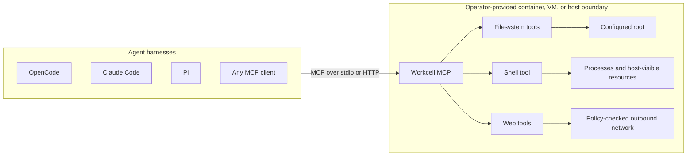
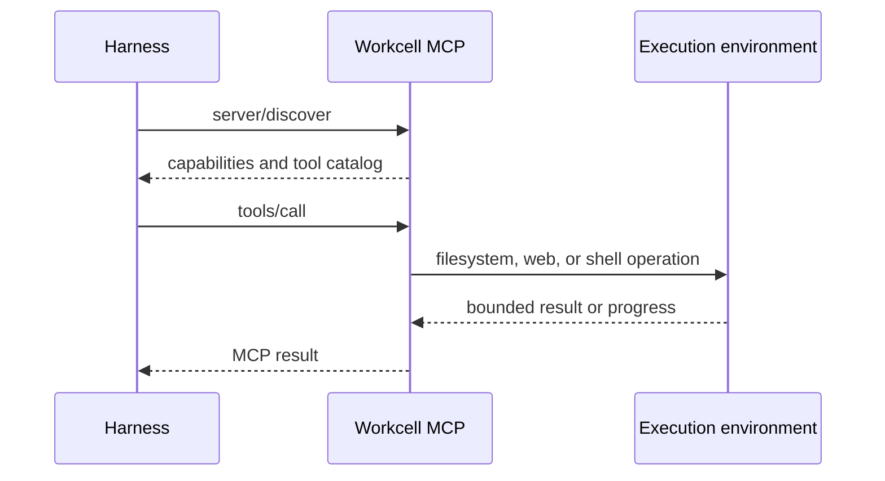
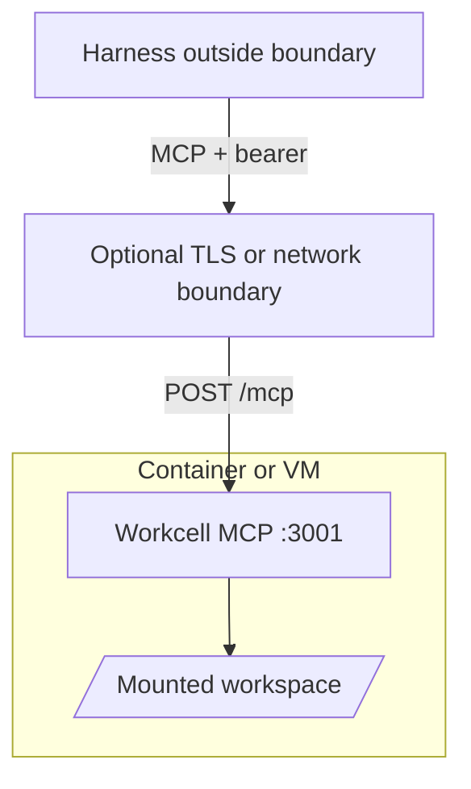

# Workcell MCP

Workcell MCP is a portable, harness-independent execution server for filesystem, web, and shell
tools. Run it directly over stdio or deploy it inside a container, VM, sandbox, or dedicated host and
connect any compatible MCP client.

Workcell has no users, teams, workspaces, deployment records, or tenant routing. One server process
represents one execution environment.

> [!WARNING]
> Workcell does not create a sandbox. Its tools inherit the filesystem, process, network, and resource
> boundary of the environment in which the server runs. Put Workcell inside the isolation boundary you
> intend an agent to access.

## Architecture



The harness decides what to do. Workcell executes tool calls where it is deployed. Isolation,
resource limits, credentials, mounts, and network policy belong to the container, VM, sandbox, or
host operator.



## Tools

| Group | Tools | Notes |
| --- | --- | --- |
| Files | `file_read`, `file_glob`, `file_grep` | Root-confined, bounded reads and search. |
| Files | `file_write`, `file_edit`, `file_apply_patch` | Preview-only unless `--allow-write` is set. |
| Web | `websearch`, `webfetch` | Search defaults to credential-free Exa; fetch applies SSRF and response bounds. |
| Shell | `shell` | Applies immutable command policy, then executes with ordered progress and a cleaned environment. |
| Server | `execution_environment` | Returns a fresh, sanitized execution-environment snapshot using bounded fixed probes. |

All groups are enabled by default. Use repeatable `--tool-group files|web|shell` arguments to expose a
subset. Files and shell require a positional root.

The filesystem tools enforce a canonical root. The shell tool uses that root as its initial working
directory, but shell commands can deliberately access any path, network, or process visible inside the
deployment environment.

Shell execution is denied by default. Configure `--shell-policy` for explicit allow/deny rules, or use
`--yolo` inside an appropriate isolation boundary to permit unmatched commands. Explicit policy denies
still win under `--yolo`.

## Requirements

- Rust 1.97 for source builds
- Linux is the primary production target
- Bash is required for the shell tool in the production container

## Quick Start

Build and run all tools over stdio:

```bash
cargo build --release --locked
./target/release/workcell-mcp \
  --allow-write \
  --shell-policy shell-policy.example.toml \
  /absolute/workspace/root
```

Run only web tools; no filesystem root is required:

```bash
workcell-mcp --tool-group web
```

Run loopback HTTP on port 3001:

```bash
workcell-mcp --transport http --port 3001 --allow-write /absolute/workspace/root
```

The only HTTP MCP endpoint is `POST /mcp`. HTTP is stateless and emits one readiness JSON line on
stdout after binding.

## Client Configuration

For clients that launch stdio servers, configure the binary and root directly. The exact configuration
file differs by client, but the MCP server entry has this shape:

```json
{
  "mcpServers": {
    "workcell": {
      "command": "/absolute/path/to/workcell-mcp",
      "args": [
        "--allow-write",
        "--shell-policy",
        "/absolute/path/to/shell-policy.toml",
        "/absolute/workspace/root"
      ]
    }
  }
}
```

For detached HTTP deployments, configure the client with the server's `/mcp` URL and, when enabled,
an `Authorization: Bearer ...` header.

## Isolated Deployment

Build the image:

```bash
docker build -t workcell-mcp:local .
```

Generate a bearer token and run a hardened container:

```bash
export WORKCELL_MCP_HTTP_TOKEN="$(openssl rand -hex 32)"

docker run --rm \
  --read-only \
  --cap-drop ALL \
  --security-opt no-new-privileges \
  --pids-limit 128 \
  --tmpfs /tmp:rw,noexec,nosuid,size=16777216 \
  --mount type=bind,src=/absolute/workspace/root,dst=/workspace \
  --publish 127.0.0.1:3001:3001 \
  --env WORKCELL_MCP_HTTP_TOKEN \
  workcell-mcp:local \
  --transport http \
  --http-bind container \
  --allow-write \
  /workspace
```

Container bind listens on `0.0.0.0` and therefore requires a bearer token of at least 32 bytes.
Loopback HTTP may run without authentication. Workcell provides no TLS; terminate TLS and apply
network policy outside the process when crossing a trusted local boundary.

## Shell Policy

Shell policy is immutable process configuration loaded from a bounded regular TOML file. Workcell uses
tree-sitter Bash parsing to extract each command scope before process creation. Denies are evaluated
first across the complete request, so `git diff && rm -rf /` cannot partially run when `rm *` is denied.

```toml
version = 1
default = "deny"
allow = ["cargo *", "git diff*", "git status"]
deny = ["rm *", "git push*"]
```

Patterns are exact strings or prefix globs with a single trailing `*`. Unmatched scopes use `default`,
which is `deny` when omitted. `--yolo` or `WORKCELL_MCP_YOLO=true` permits unmatched scopes while
preserving explicit denies. `WORKCELL_MCP_SHELL_POLICY` is the environment equivalent of
`--shell-policy`. See [`shell-policy.example.toml`](shell-policy.example.toml).

Malformed or opaque shell syntax is denied by default. `--yolo` admits fully classified unmatched
scopes. It admits opaque syntax only when no deny rules are configured; otherwise Workcell cannot prove
that a hidden executable does not match a deny and fails closed. This parser is a policy aid, not a
sandbox: wrappers, interpreters, aliases, functions, dynamic expansion, and allowed programs can
execute behavior not visible as a direct syntax-tree command. Keep OS isolation and egress controls.

> [!CAUTION]
> Shell policy is best-effort syntactic policy, not complete behavioral enforcement. An MCP client or
> LLM agent can use writable file tools when `--allow-write` is enabled, or an allowed shell command,
> to create a Bash, JavaScript, Python, Perl, or other script and then execute it through an allowed
> interpreter. Workcell authorizes the visible invocation such as `python script.py`; it does not parse
> or authorize the script's contents. Likewise, denying `rm *` does not prevent an allowed Python or
> Node.js process from deleting files. Use a container, VM, sandbox, filesystem permissions, and network
> policy as the actual security boundary.

Admission failures are returned as MCP tool errors with an actionable message for the harness. The
message identifies the generalized scope when available, explains whether an allow or deny rule
blocked execution, and states that only the Workcell operator can change immutable policy. Oversized
commands report the actual UTF-8 byte count and the 65536-byte limit. MCP commands are JSON strings, so
malformed JSON or non-UTF-8 payloads are rejected by the transport before shell dispatch.



## HTTP Security

- `--http-bind loopback` binds `127.0.0.1` and permits unauthenticated local use.
- `--http-bind container` binds `0.0.0.0` and fails startup without authentication.
- `WORKCELL_MCP_HTTP_TOKEN` supplies a direct process-level bearer.
- `--http-token-file` or `WORKCELL_MCP_HTTP_TOKEN_FILE` reads the bearer from a regular bounded file.
- `--allowed-host` or `WORKCELL_MCP_ALLOWED_HOSTS` controls accepted HTTP host authorities.
- Browser `Origin` headers, non-POST methods, unknown routes, invalid JSON, and bodies over 12 MiB are rejected.
- There are no lease, user, tenant, administration, or dynamic configuration endpoints.

Token files and `WORKCELL_MCP_HTTP_TOKEN` are mutually exclusive. Prefer a mounted secret file where
the deployment platform supports one.

## Web Configuration

`websearch` uses Exa's credential-free hosted search by default; no API key is required. Search queries
are sent to Exa, a third-party provider, and are subject to its privacy terms, availability, and
anonymous rate limits. Set `WORKCELL_WEBSEARCH_BACKEND=disabled` to disable search while retaining
`webfetch`, or select another backend explicitly:

| Backend | Configuration |
| --- | --- |
| Exa MCP (default) | No configuration, or `WORKCELL_WEBSEARCH_BACKEND=exa-mcp`; no API key |
| Disabled | `WORKCELL_WEBSEARCH_BACKEND=disabled`; `webfetch` remains available |
| SearXNG | `WORKCELL_WEBSEARCH_BACKEND=searxng`, `SEARXNG_URL`, and at most one supported credential mode |
| Exa direct API | `WORKCELL_WEBSEARCH_BACKEND=exa`, `EXA_API_KEY` |
| Brave | `WORKCELL_WEBSEARCH_BACKEND=brave`, `BRAVE_API_KEY` |
| Kagi | `WORKCELL_WEBSEARCH_BACKEND=kagi`, `KAGI_API_KEY` |
| SerpApi | `WORKCELL_WEBSEARCH_BACKEND=serpapi`, `SERPAPI_API_KEY`, `SERPAPI_ENGINE=google|bing` |

Source-icon resolution is disabled by default for both `websearch` and `webfetch`. Enable it with
`--web-icons` or `WORKCELL_WEB_ICONS=true`. Opting in may issue additional requests to result/page
origins and embeds verified `iconUrl` and `iconDataUrl` fields in structured output.

Use `--env-file path/to/server.env` to load defaults. Configuration precedence is CLI, process
environment, selected dotenv file, then built-in defaults. Secret values are redacted from debug
representations and logs.

See [`example.env`](example.env) for the full environment surface.

## Protocol

Workcell implements modern MCP `2026-07-28` and an exact `2025-11-25` compatibility fallback through
the pinned Rust MCP SDK revision in `Cargo.toml`. Discovery advertises the modern revision first.
Modern-aware clients that probe with `server/discover` select it; clients that open directly with the
legacy `initialize` handshake remain on `2025-11-25` because a server cannot force them to upgrade.

Use `--modern-only` or `WORKCELL_MCP_MODERN_ONLY=true` to reject legacy initialization. The default
dual-era posture is:

| Client opening | Selected behavior |
| --- | --- |
| `server/discover` or complete per-request metadata | Stateless `2026-07-28` |
| `initialize` requesting exactly `2025-11-25` | Legacy wire format with no HTTP session state |
| Older, unknown, or legacy initialization under modern-only mode | `UnsupportedProtocolVersionError` |

- Discovery starts with `server/discover`.
- HTTP is stateless Streamable HTTP at `POST /mcp` for both versions. Workcell does not issue or accept
  `Mcp-Session-Id`; GET streams and DELETE lifecycle requests remain disabled.
- Stdio uses the SDK newline-delimited transport.
- Modern tool, discovery, and list responses use complete-result envelopes. The SDK omits modern-only
  result and caching fields for legacy peers.
- Cancellation is cooperative; shell calls publish ordered progress when requested. Each progress
  notification includes a bounded, single-line standard `message` field with control and
  bidirectional formatting characters escaped, plus an `ai.workcell/tool-output-chunk` metadata
  object with the exact sequence, stream, and text.
- Tasks, OAuth, protocol-level sessions, standalone HTTP GET streams, and MCP DELETE are not advertised.

### Live shell output

The `shell` tool streams stdout and stderr through the standard MCP
[`notifications/progress`](https://modelcontextprotocol.io/specification/2026-07-28/basic/patterns/progress)
mechanism. Shell output is never written as raw data to the server's protocol stdout. A client opts
in per call by including a unique string or integer `progressToken` in the request `_meta`:

```json
{
  "jsonrpc": "2.0",
  "id": 42,
  "method": "tools/call",
  "params": {
    "name": "shell",
    "arguments": { "command": "make" },
    "_meta": {
      "progressToken": "shell-42",
      "io.modelcontextprotocol/protocolVersion": "2026-07-28",
      "io.modelcontextprotocol/clientCapabilities": {},
      "io.modelcontextprotocol/clientInfo": {
        "name": "example-client",
        "version": "1.0.0"
      }
    }
  }
}
```

Workcell then publishes each accepted output chunk before the final tool result:

```json
{
  "jsonrpc": "2.0",
  "method": "notifications/progress",
  "params": {
    "progressToken": "shell-42",
    "progress": 1,
    "message": "[stdout] compiling\\n",
    "_meta": {
      "ai.workcell/tool-output-chunk": {
        "version": 1,
        "sequence": 1,
        "stream": "stdout",
        "text": "compiling\n"
      }
    }
  }
}
```

- `progress` and `sequence` increase monotonically; the final result's `finalSequence` identifies the
  last emitted chunk.
- `message` is a bounded, single-line display fallback. Exact output remains in the namespaced
  metadata, including whether it came from stdout or stderr.
- Stdio clients receive progress as newline-delimited JSON-RPC notifications. HTTP clients receive it
  on the originating request's SSE response stream.
- Without a progress token, Workcell still drains and bounds the process pipes but returns output only
  in the final stdout/stderr tails.
- Clients must consume notifications while `tools/call` is pending and decide how to render them.
  Supporting MCP transport alone does not guarantee visible live output.
- Child programs may buffer output when connected to pipes instead of a terminal. Use program-specific
  unbuffered or line-buffered modes when immediate output matters.

Clients may negotiate `ai.workcell/execution-environment` version `v1` to receive a sanitized startup
snapshot during discovery. The `execution_environment` tool returns the same descriptor shape from a
fresh bounded inspection, so clients can observe later command installation or version changes, Git
repository state, package-manager metadata, and recognized lockfiles without restarting Workcell.
Concurrent tool inspections are serialized.

Both surfaces report platform and container classifications, enabled tool groups, workspace metadata,
and command availability. Fixed command probes resolve only executable targets outside the configured
root, receive a `PATH` containing only canonical directories outside that root, then run with version
or client-only arguments from the executable's parent directory, a cleaned allowlisted environment,
bounded output, and short deadlines. Results never include raw root paths, environment values, probe
output, file contents, tool arguments, or credentials. Availability and container, sandbox, and
network classifications are best-effort observations rather than security guarantees. Disable both
surfaces with `--no-expose-execution-environment`.

## Development

```bash
make
```

Plain `make` runs the complete local CI pipeline. Run `make help` for focused formatting, checking,
testing, installation, local execution, and container targets. `make docker-run
ROOT=/absolute/workspace` starts the hardened HTTP topology documented above and requires
`WORKCELL_MCP_HTTP_TOKEN` in the invoking environment.

The conformance fixtures under `fixtures/mcp-conformance` are committed compatibility contracts for
tool schemas and bounded behavior. Update fixtures deliberately when a public tool contract changes.

## Project Layout

```text
src/                   Workcell host, transports, CLI, and process policy
crates/mcp-files/      Filesystem tools
crates/mcp-shell/      Shell tool and progress streaming
crates/mcp-web/        Search, fetch, extraction, and PDF handling
crates/net/            Outbound URL, DNS, redirect, retry, and body policy
crates/source-icons/   Bounded favicon discovery and normalization
fixtures/              Cross-crate MCP conformance fixtures
```

## License

Apache-2.0. See [`LICENSE.md`](LICENSE.md).
