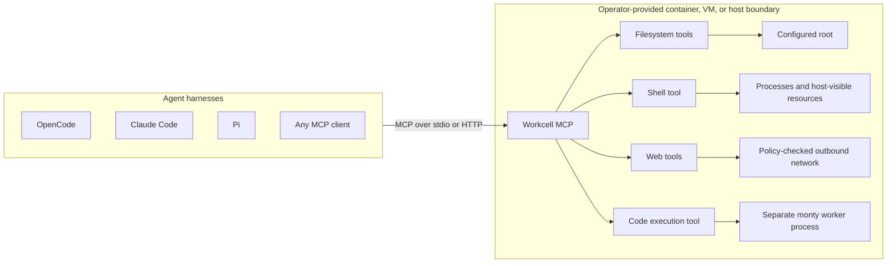
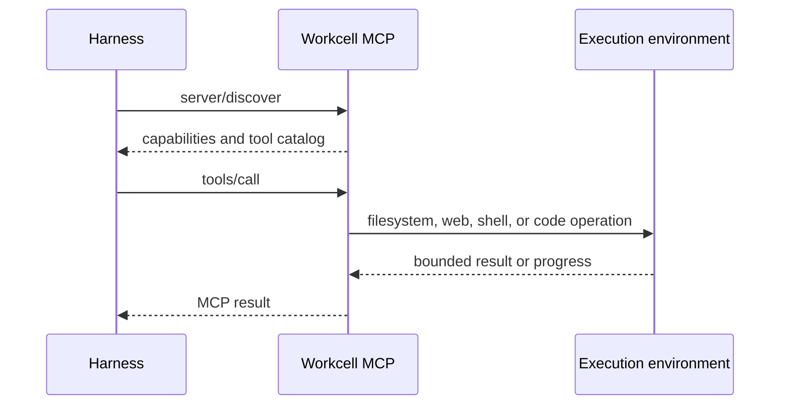
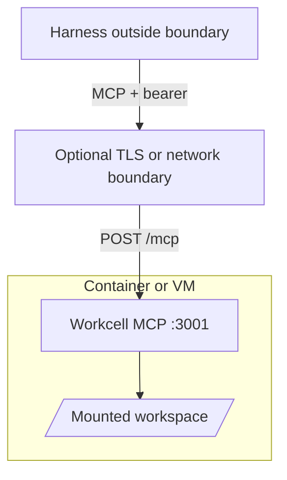

# Workcell MCP

Workcell MCP is a portable, harness-independent execution server for filesystem, web, and shell
tools. Run it directly over stdio or deploy it inside a container, VM, sandbox, or dedicated host and
connect any compatible MCP client.

Workcell has no users, teams, workspaces, deployment records, or tenant routing. One server process
represents one execution environment.

> [!WARNING]
> Workcell does not create a sandbox. Its tools inherit the filesystem, process, network, and resource
> boundary of the environment in which the server runs. Put Workcell inside the isolation boundary you
> intend an agent to access.

## Architecture



The harness decides what to do. Workcell executes tool calls where it is deployed. Isolation,
resource limits, credentials, mounts, and network policy belong to the container, VM, sandbox, or
host operator.



## Tools

| Group | Tools | Notes |
| --- | --- | --- |
| Files | `file_read`, `file_glob`, `file_grep` | Root-confined, bounded reads and search. |
| Files | `file_write`, `file_edit`, `file_apply_patch` | Present in the catalog only when `--allow-write` is set. |
| Files | `index` | Bounded source skeletons and deterministic directory listings. |
| Web | `websearch`, `webfetch` | Search defaults to credential-free Exa; fetch applies SSRF and response bounds. |
| Shell | `shell` | Applies immutable command policy, then executes with ordered progress and a cleaned environment. |
| Code | `code_execution` | Runs a Python snippet in a separate worker process with no filesystem, network, or environment access. |
| Server | `execution_environment` | Returns fresh sanitized platform, privilege, package-manager, and command observations. |

All groups are enabled by default. Use repeatable `--tool-group files|web|shell|code` arguments to
expose a subset. Files and shell require a positional root.

The filesystem tools enforce a canonical root. The shell tool uses that root as its initial working
directory, but shell commands can deliberately access any path, network, or process visible inside the
deployment environment.

Shell execution is denied by default. Configure `--shell-policy` for explicit allow/deny rules, or use
`--yolo` inside an appropriate isolation boundary to permit unmatched commands. Explicit policy denies
still win under `--yolo`.

The code tool is unrelated to the shell policy. It evaluates a snippet in a `monty` worker process
that has no filesystem, no network, no subprocesses, and an empty environment, so it needs no root
and no policy. It is for computation, not for reaching the host. It requires the `monty` worker
binary, which is installed from a pinned release rather than built with the workspace. Workcell
release/install builds embed it, the container ships it beside the server, and source builds produce
it with `make code-worker`. An explicit `--code-worker` is authoritative; otherwise discovery checks
beside the server, then the embedded worker, then `PATH`. When no worker is available, startup fails
rather than exposing a tool that cannot run.

## Requirements

- Rust 1.98 for source builds
- The code tool group needs the pinned `monty` worker binary: `make code-worker`
- Linux is the primary production target
- Bash is required for the shell tool in the production container

## Quick Start

Build and run all tools over stdio:

```bash
cargo build --release --locked
./target/release/workcell-mcp \
  --allow-write \
  --shell-policy shell-policy.example.toml \
  /absolute/workspace/root
```

Run only web tools; no filesystem root is required:

```bash
workcell-mcp --tool-group web
```

Run loopback HTTP on port 3001:

```bash
workcell-mcp --transport http --port 3001 --allow-write /absolute/workspace/root
```

The only HTTP MCP endpoint is `POST /mcp`. HTTP is stateless and emits one readiness JSON line on
stdout after binding.

## Client Configuration

For clients that launch stdio servers, configure the binary and root directly. The exact configuration
file differs by client, but the MCP server entry has this shape:

```json
{
  "mcpServers": {
    "workcell": {
      "command": "/absolute/path/to/workcell-mcp",
      "args": [
        "--allow-write",
        "--shell-policy",
        "/absolute/path/to/shell-policy.toml",
        "/absolute/workspace/root"
      ]
    }
  }
}
```

For detached HTTP deployments, configure the client with the server's `/mcp` URL and, when enabled,
an `Authorization: Bearer ...` header.

## Isolated Deployment

Build the image:

```bash
docker build -t workcell-mcp:local .
```

Generate a bearer token and run a hardened container:

```bash
export WORKCELL_MCP_HTTP_TOKEN="$(openssl rand -hex 32)"

docker run --rm \
  --read-only \
  --cap-drop ALL \
  --security-opt no-new-privileges \
  --pids-limit 128 \
  --tmpfs /tmp:rw,noexec,nosuid,size=16777216 \
  --mount type=bind,src=/absolute/workspace/root,dst=/workspace \
  --publish 127.0.0.1:3001:3001 \
  --env WORKCELL_MCP_HTTP_TOKEN \
  workcell-mcp:local \
  --transport http \
  --http-bind container \
  --allow-write \
  /workspace
```

Container bind listens on `0.0.0.0` and therefore requires a bearer token of at least 32 bytes.
Loopback HTTP may run without authentication. Workcell provides no TLS; terminate TLS and apply
network policy outside the process when crossing a trusted local boundary.

## Shell Policy

Shell policy is immutable process configuration loaded from a bounded regular TOML file. Workcell uses
tree-sitter Bash parsing to extract each command scope before process creation. Denies are evaluated
first across the complete request, so `git diff && rm -rf /` cannot partially run when `rm *` is denied.

```toml
version = 1
default = "deny"
allow = ["cargo *", "git diff*", "git status"]
deny = ["rm *", "git push*"]
```

Patterns are exact strings or prefix globs with a single trailing `*`. Unmatched scopes use `default`,
which is `deny` when omitted. `--yolo` or `WORKCELL_MCP_YOLO=true` permits unmatched scopes while
preserving explicit denies. `WORKCELL_MCP_SHELL_POLICY` is the environment equivalent of
`--shell-policy`. See [`shell-policy.example.toml`](shell-policy.example.toml).

Malformed or opaque shell syntax is denied by default. `--yolo` admits fully classified unmatched
scopes. It admits opaque syntax only when no deny rules are configured; otherwise Workcell cannot prove
that a hidden executable does not match a deny and fails closed. This parser is a policy aid, not a
sandbox: wrappers, interpreters, aliases, functions, dynamic expansion, and allowed programs can
execute behavior not visible as a direct syntax-tree command. Keep OS isolation and egress controls.

> [!CAUTION]
> Shell policy is best-effort syntactic policy, not complete behavioral enforcement. An MCP client or
> LLM agent can use writable file tools when `--allow-write` is enabled, or an allowed shell command,
> to create a Bash, JavaScript, Python, Perl, or other script and then execute it through an allowed
> interpreter. Workcell authorizes the visible invocation such as `python script.py`; it does not parse
> or authorize the script's contents. Likewise, denying `rm *` does not prevent an allowed Python or
> Node.js process from deleting files. Use a container, VM, sandbox, filesystem permissions, and network
> policy as the actual security boundary.

Admission failures are returned as MCP tool errors with an actionable message for the harness. The
message identifies the generalized scope when available, explains whether an allow or deny rule
blocked execution, and states that only the Workcell operator can change immutable policy. Oversized
commands report the actual UTF-8 byte count and the 65536-byte limit. MCP commands are JSON strings, so
malformed JSON or non-UTF-8 payloads are rejected by the transport before shell dispatch.



## HTTP Security

- `--http-bind loopback` binds `127.0.0.1` and permits unauthenticated local use.
- `--http-bind container` binds `0.0.0.0` and fails startup without authentication.
- `WORKCELL_MCP_HTTP_TOKEN` supplies a direct process-level bearer.
- `--http-token-file` or `WORKCELL_MCP_HTTP_TOKEN_FILE` reads the bearer from a regular bounded file.
- `--allowed-host` or `WORKCELL_MCP_ALLOWED_HOSTS` controls accepted HTTP host authorities.
- Browser `Origin` headers, non-POST methods, unknown routes, invalid JSON, and bodies over 12 MiB are rejected.
- There are no lease, user, tenant, administration, or dynamic configuration endpoints.

Token files and `WORKCELL_MCP_HTTP_TOKEN` are mutually exclusive. Prefer a mounted secret file where
the deployment platform supports one.

## Web Configuration

`websearch` uses Exa's credential-free hosted search by default; no API key is required. Search queries
are sent to Exa, a third-party provider, and are subject to its privacy terms, availability, and
anonymous rate limits. Set `WORKCELL_WEBSEARCH_BACKEND=disabled` to disable search while retaining
`webfetch`, or select another backend explicitly:

| Backend | Configuration |
| --- | --- |
| Exa MCP (default) | No configuration, or `WORKCELL_WEBSEARCH_BACKEND=exa-mcp`; no API key |
| Disabled | `WORKCELL_WEBSEARCH_BACKEND=disabled`; `webfetch` remains available |
| SearXNG | `WORKCELL_WEBSEARCH_BACKEND=searxng`, `SEARXNG_URL`, and at most one supported credential mode |
| Exa direct API | `WORKCELL_WEBSEARCH_BACKEND=exa`, `EXA_API_KEY` |
| Brave | `WORKCELL_WEBSEARCH_BACKEND=brave`, `BRAVE_API_KEY` |
| Kagi | `WORKCELL_WEBSEARCH_BACKEND=kagi`, `KAGI_API_KEY` |
| SerpApi | `WORKCELL_WEBSEARCH_BACKEND=serpapi`, `SERPAPI_API_KEY`, `SERPAPI_ENGINE=google|bing` |

Source-icon resolution is disabled by default for both `websearch` and `webfetch`. Enable it with
`--web-icons` or `WORKCELL_WEB_ICONS=true`. Opting in may issue additional requests to result/page
origins and embeds verified `iconUrl` and `iconDataUrl` fields in structured output.

Use `--env-file path/to/server.env` to load defaults. Configuration precedence is CLI, process
environment, selected dotenv file, then built-in defaults. Secret values are redacted from debug
representations and logs.

See [`example.env`](example.env) for the full environment surface.

## Protocol

Workcell implements modern MCP `2026-07-28` and an exact `2025-11-25` compatibility fallback through
the pinned Rust MCP SDK revision in `Cargo.toml`. Discovery advertises the modern revision first.
Modern-aware clients that probe with `server/discover` select it; clients that open directly with the
legacy `initialize` handshake remain on `2025-11-25` because a server cannot force them to upgrade.

Use `--modern-only` or `WORKCELL_MCP_MODERN_ONLY=true` to reject legacy initialization. The default
dual-era posture is:

| Client opening | Selected behavior |
| --- | --- |
| `server/discover` or complete per-request metadata | Stateless `2026-07-28` |
| `initialize` requesting exactly `2025-11-25` | Legacy wire format with no HTTP session state |
| Older, unknown, or legacy initialization under modern-only mode | `UnsupportedProtocolVersionError` |

- Discovery starts with `server/discover`.
- HTTP is stateless Streamable HTTP at `POST /mcp` for both versions. Workcell does not issue or accept
  `Mcp-Session-Id`; GET streams and DELETE lifecycle requests remain disabled.
- Stdio uses the SDK newline-delimited transport.
- Modern tool, discovery, and list responses use complete-result envelopes. The SDK omits modern-only
  result and caching fields for legacy peers.
- Cancellation is cooperative; shell calls publish ordered progress when requested. Each progress
  notification includes a bounded, single-line standard `message` field with control and
  bidirectional formatting characters escaped, plus an `ai.workcell/tool-output-chunk` metadata
  object with the exact sequence, stream, and text.
- Tasks, OAuth, protocol-level sessions, standalone HTTP GET streams, and MCP DELETE are not advertised.

### Live shell output

The `shell` tool streams stdout and stderr through the standard MCP
[`notifications/progress`](https://modelcontextprotocol.io/specification/2026-07-28/basic/patterns/progress)
mechanism. Shell output is never written as raw data to the server's protocol stdout. A client opts
in per call by including a unique string or integer `progressToken` in the request `_meta`:

```json
{
  "jsonrpc": "2.0",
  "id": 42,
  "method": "tools/call",
  "params": {
    "name": "shell",
    "arguments": { "command": "make" },
    "_meta": {
      "progressToken": "shell-42",
      "io.modelcontextprotocol/protocolVersion": "2026-07-28",
      "io.modelcontextprotocol/clientCapabilities": {},
      "io.modelcontextprotocol/clientInfo": {
        "name": "example-client",
        "version": "1.0.0"
      }
    }
  }
}
```

Workcell then publishes each accepted output chunk before the final tool result:

```json
{
  "jsonrpc": "2.0",
  "method": "notifications/progress",
  "params": {
    "progressToken": "shell-42",
    "progress": 1,
    "message": "[stdout] compiling\\n",
    "_meta": {
      "ai.workcell/tool-output-chunk": {
        "version": 1,
        "sequence": 1,
        "stream": "stdout",
        "text": "compiling\n"
      }
    }
  }
}
```

- `progress` and `sequence` increase monotonically; the final result's `finalSequence` identifies the
  last emitted chunk.
- `message` is a bounded, single-line display fallback. Exact output remains in the namespaced
  metadata, including whether it came from stdout or stderr.
- Stdio clients receive progress as newline-delimited JSON-RPC notifications. HTTP clients receive it
  on the originating request's SSE response stream.
- Without a progress token, Workcell still drains and bounds the process pipes but returns output only
  in the final stdout/stderr tails.
- Clients must consume notifications while `tools/call` is pending and decide how to render them.
  Supporting MCP transport alone does not guarantee visible live output.
- Child programs may buffer output when connected to pipes instead of a terminal. Use program-specific
  unbuffered or line-buffered modes when immediate output matters.

### Shell Output Filtering

Build tools, test runners, and package managers spend most of their output on progress rather than
information. Workcell filters the model-facing shell rendering through a built-in rule corpus so a
successful `cargo build` returns its warnings instead of several hundred `Compiling` lines. Filtering
is on by default.

Rules match the same tree-sitter command scope that shell policy authorizes, not the raw command
string, so shell metacharacters cannot steer rule selection. A rule applies only when the command
resolves to exactly one non-opaque scope; output from a pipeline or chain belongs to more than one
program and is returned unfiltered. A rule that would replace output with a success summary is
suppressed unless the command actually exited zero, so a failing command is never rendered as success.

The corpus covers common build, test, package-manager, and container commands, including `cargo`,
`go`, `mvn`, `git`, `npm`, `pip`, `apt`, `pytest`, `jest`, `vitest`, `tar`, `wget`, `docker build`,
`docker pull`, and `docker compose`. A command with no matching rule is returned unchanged.

Rules are scoped to the subcommands whose output is progress. A command whose output is the result
the caller asked for is left alone: `apt list`, `tar -t`, `docker compose logs`, and `docker run`
have no rule, and the container's own output is never reinterpreted.

The corpus is fixed at build time and is not operator-extensible. There is no project-local rule file,
so a rule cannot be introduced by the contents of a workspace. A command that resolves to more than
one scope, or that carries an inline environment assignment such as `FOO=bar cmd`, is opaque to scope
analysis and is never filtered.

Filtering never enlarges a result. The notice a filtered rendering carries is not free, so when a
rule strips nothing, or strips less than the notice costs, Workcell returns the complete capture
instead. A filtered rendering is therefore always smaller than the unfiltered one it replaced.

Filtering affects only the rendering:

- The structured result always carries the unfiltered bounded tails and the complete byte accounting.
- `notifications/progress` chunks are streamed unfiltered as the process produces them, because
  filtering requires the whole output and an exit code.
- Filtered renderings are annotated with the rule that produced them.

Disable filtering with `--no-shell-output-filter` or `WORKCELL_MCP_SHELL_OUTPUT_FILTER=false` to
return raw command output. Rules in `crates/output-filter/rules/` are vendored from
[RTK](https://github.com/rtk-ai/rtk) under Apache-2.0; rules in `crates/output-filter/rules-workcell/`
are original to this project. See `crates/output-filter/NOTICE`.

Clients may negotiate `ai.workcell/execution-environment` version `v1` to receive a sanitized startup
snapshot during discovery. The `execution_environment` tool returns the same descriptor shape from a
fresh bounded inspection, so clients can observe later command installation or version changes,
effective-root and non-interactive sudo status, the platform's system package manager, Git repository
state, project package-manager metadata, and recognized lockfiles without restarting Workcell.
Concurrent tool inspections are serialized.

Both surfaces report platform and container classifications, privilege observations, enabled tool
groups, workspace metadata, and command availability. Fixed command probes resolve only executable
targets outside the configured root, receive a `PATH` containing only canonical directories outside
that root, then run with fixed arguments from the executable's parent directory, a cleaned allowlisted
environment, bounded output, and short deadlines. Results never include raw root paths, environment
values, probe output, file contents, tool arguments, or credentials. Availability and privilege,
package-manager, container, sandbox, and network classifications are best-effort observations rather
than security or authorization guarantees. Disable both surfaces with
`--no-expose-execution-environment`.

## Embedding

Workcell's tool groups are usable directly from another Rust program with no MCP transport or MCP
dependency. MCP is one projection of the tool contracts, not their definition. The code group still
launches its isolated Monty worker subprocess.

The `workcell` facade is the single entry point. Each tool group is a feature, so a host compiles
only what it uses:

```toml
[dependencies]
workcell = { git = "https://github.com/tensorninja/workcell-mcp", default-features = false, features = ["files"] }
```

| Feature | Provides |
| --- | --- |
| `files` | `FileToolGroup`, `PreparedFilePatch`, filesystem schemas and bounded operations |
| `files-index` | `files` plus `index`, its typed output, and the feature-gated parser bundle |
| `web` | `WebToolGroup`, `PreparedWebsearch`, `PreparedWebfetch`, extraction and provider lowering |
| `shell` | `ShellToolGroup`, `PreparedShell`, scope analysis and progress streaming |
| `code` | `CodeToolGroup`, isolated interpreter execution |
| `code-bundled` | `code` plus verified extraction of a build-time embedded Monty worker |
| `environment` | `ExecutionEnvironment` inspection |

`ToolSpec` carries the protocol-neutral contract: name, description, input and output schemas,
annotations, presentation profile, and a stable contract identity. A host registers those directly.
Enabling a group's `mcp` feature additionally projects the same spec into an MCP `Tool`, which is how
the standalone server builds its catalog; without it, `rmcp` is not in the dependency graph at all.

Operations separate preparation from execution. `inspect_index`, `prepare_apply_patch`,
`ShellToolGroup::prepare`, and
the web `prepare_*` methods return a prepared value that exposes every resource the call would touch,
before anything is read, written, or executed. Hosts authorize the prepared resources under their own
policy, then commit with the matching `execute_*` method.

A shell execution returns both renderings on one value. `ShellExecution::model_text` is the filtered,
model-facing form and `ShellExecution::output` is the unfiltered capture with the complete byte
accounting. `ShellExecution::filter` identifies the applied rule and the unfiltered and filtered
rendering sizes when filtering reduced the result, so hosts do not need to parse presentation text.
A host that keeps a transcript or builds its own presentation never has to disable filtering to
obtain the real bytes. Live output is independent of both: chunks delivered to a
`ShellProgressSink` are published while the process runs, before an exit code exists, and are never
filtered. Filtering therefore changes only what a model reads, never what a host can observe.

### Confinement is a host decision

`FileToolGroup::new` and `ShellToolGroup::with_policy` confine to a root, exactly as the standalone
server does. The `_unconfined` constructors are for hosts that own authorization themselves, and they
relax **confinement only** — every other axis stays an explicit argument:

```rust
// Inspection-only hosting: reaches anywhere the process can, but cannot mutate.
let files = FileToolGroup::new_unconfined(&base_cwd, false, None).await?;

// Host-owned shell policy with host-managed workdirs.
let shell = ShellToolGroup::with_policy_unconfined(&base_cwd, policy).await?;
```

`FileToolGroup::new_unconfined` disables root-escape rejection *and* protected-path denial together,
so `.env`, `.ssh`, `.netrc`, `*.key`, and `id_rsa` become reachable. Enumeration matches: broad
traversal reports those entries too, so a host can always discover what a call would touch. Passing
`allow_write = false` keeps that reach read-only. `ShellToolGroup::new_unconfined` relaxes workdir
resolution while leaving permission policy fail-closed.

Run `make check-native` to verify every facade feature builds with no MCP adapter linked.

`CodeConfiguration` selects an explicit external worker, a bundled-only worker with a host-provided
cache root, or discovery. Discovery checks beside the host executable, then the configured bundle,
then `PATH`. Explicit paths are authoritative and never fall back. Set
`WORKCELL_BUNDLED_MONTY_WORKER` while compiling `code-bundled` to embed a target-matching worker;
`make release` and `make install` do this automatically. The standalone cache defaults to the platform
cache directory and can be overridden with `--code-worker-cache` or
`WORKCELL_MCP_CODE_WORKER_CACHE`. Configure one explicitly when the platform cache directory cannot be
determined, and keep it owned by the Workcell process identity rather than sharing it across users.

## Development

```bash
make
```

Plain `make` runs the complete local CI pipeline. Run `make help` for focused formatting, checking,
testing, installation, local execution, and container targets. `make docker-run
ROOT=/absolute/workspace` starts the hardened HTTP topology documented above and requires
`WORKCELL_MCP_HTTP_TOKEN` in the invoking environment.

The conformance fixtures under `fixtures/mcp-conformance` are committed compatibility contracts for
tool schemas and bounded behavior. Update fixtures deliberately when a public tool contract changes.

## Project Layout

```text
src/                   Workcell host, transports, CLI, and process policy
crates/workcell/       Protocol-neutral embedding facade for native hosts
crates/tool-contract/  Protocol-neutral tool contracts shared by every group
crates/monty-worker/   Target validation, embedded worker bytes, extraction, and leases
crates/mcp-files/      Filesystem tools
crates/mcp-shell/      Shell tool and progress streaming
crates/mcp-code/       Code execution tool and worker-process supervision
crates/mcp-web/        Search, fetch, extraction, and PDF handling
crates/environment/    Execution environment inspection
crates/net/            Outbound URL, DNS, redirect, retry, and body policy
crates/source-icons/   Bounded favicon discovery and normalization
fixtures/              Cross-crate MCP conformance fixtures
```

## Tool Reference

Tool schemas are returned by `tools/list` and remain the authority for the arguments accepted by a
particular server configuration. Argument validation is repeated during dispatch rather than relying
on clients to honor those schemas. Every tool returns bounded model-facing text and, where applicable,
structured content for clients that can render richer results.

Workcell also publishes MCP tool annotations as presentation hints. Filesystem reads are read-only and
closed-world. Web search and fetch are read-only but open-world because they contact external services.
Environment inspection is non-destructive but not read-only, idempotent, or closed-world because its
sudo probe may update authentication state or invoke external policy plugins. Filesystem mutations and
shell execution are marked potentially destructive. Code execution is read-only and closed-world
because the worker cannot reach the filesystem, the network, or the host environment. These
annotations do not replace client consent, Workcell admission checks, or deployment isolation.

### Filesystem tools

In the standalone server, all filesystem paths are resolved against one canonical root. Inputs may
use root-relative paths or absolute paths inside that root. Lexical escapes, stable symlink escapes,
protected paths, and paths outside the root are rejected. Broad traversal skips symlinks, protected
entries, and directories holding regenerable build output or tool caches: `.git`, `node_modules`,
`target`, `dist`, `.venv`, `venv`, `__pycache__`, `.next`, `.nuxt`, `.svelte-kit`, `.turbo`,
`.parcel-cache`, `.gradle`, `.tox`, `.mypy_cache`, `.pytest_cache`, `.ruff_cache`, `.dart_tool`,
`.terraform`, and `.stack-work`. Dependency source trees such as `vendor`, `Pods`, `deps`, and
`third_party` are deliberately searchable, as are ambiguous names such as `build`, `bin`, and `out`
that carry real source in many projects. Skipping applies only to broad traversal: naming one of
these directories as the `path` searches inside it. Binary classification uses bounded content
inspection rather than filename extensions.

Confinement is a property of the server's constructor, not of the crate. Native hosts may opt into
unconfined resolution, which disables both root confinement and protected-path denial; see
[Embedding](#embedding).

Write authority is immutable process configuration and no tool argument can negotiate it. Without
`--allow-write` the server omits `file_write`, `file_edit`, and `file_apply_patch` from `tools/list`
and does not route calls to those names, so a model is never offered a mutation that could only fail.
The three mutation schemas also reject unknown arguments, so a stale or misspelled field fails the
call instead of being silently dropped into an unintended write. Native hosts that call the group
directly are denied at the crate boundary regardless of the catalog.

The standalone defaults limit individual files and writes to 5 MiB, model-facing reads to 50 KiB,
lines to 2,000 characters, read windows to 2,000 lines, search results to 500, and broad traversal to
50,000 entries. Glob matching has an independent whole-operation work budget, sized so the heaviest
ordinary wildcard pattern can evaluate every candidate the traversal budget admits; a pathological
pattern exhausts it and truncates rather than failing. Search results are additionally fitted to the
protocol result ceiling, because one grep row can carry a full-length line. Results report truncation
when any of these bounds is reached, and `file_glob` and `file_grep` also say so in their model-facing
text. Embedders using the filesystem crate can supply stricter limits.

The optional indexer has independent defaults: 2 MiB of strict UTF-8 source, 50 KiB of model text,
2,000 bytes per output line, 1,000 returned directory entries, 10,000 scanned directory entries,
post-parse inspection limits of 200,000 syntax nodes and depth 512, two-second admission and parser
deadlines, and two process-wide parser slots. Source bytes and the parser deadline bound tree-sitter
construction work; node and depth limits are checked after construction, before extraction. These
values are host-only and never appear in model input. Native hosts enable `files-index` and pass
`IndexExecutionConfiguration` to `index_with_configuration` when a call needs a different source-size
policy.

#### `file_read`

`file_read` reads a UTF-8 text file window or lists a directory.

- `filePath` is required and must not be empty. Use `.` to address the configured root directory.
- `offset` is an optional 1-indexed starting line. `limit` controls the maximum number of returned
  lines and defaults to 2,000.
- File output prefixes each line with `<line>: ` so later calls can request precise windows. Lines over
  2,000 characters and total model-facing output are truncated independently.
- Directory output is sorted, emits one entry per line, and appends `/` to directory names.
- Binary files, oversized files, missing paths, root escapes, and unsupported file types return tool
  errors instead of partial unlabelled content.

Use `file_glob` to discover unknown paths and `file_grep` to locate relevant sections before reading a
large file.

#### `file_glob`

`file_glob` finds files by path pattern without invoking a shell.

- `pattern` is required and supports `*`, `**`, `?`, and brace alternatives such as `*.{ts,tsx}`.
- `path` optionally narrows traversal to a directory under the configured root; omission searches from
  the root.
- Matches are returned in deterministic order with relative paths, byte sizes, and line counts for
  bounded text files.
- Pattern size, brace depth, generated alternatives, matching work, traversal entries, and result count
  are all bounded. Exhausting any of them truncates the result rather than failing the call.
- `total` counts every matching file, because counting continues past the returned window. It is exact
  when `scanComplete` is true and a lower bound otherwise. A truncated result also states both numbers
  on its last line of model-facing text.

#### `file_grep`

`file_grep` searches bounded UTF-8 text files and returns matching paths, line numbers, and lines.

- `pattern` is required and uses Rust's linear-time regular-expression engine. Alternation, groups,
  character classes, anchors, and repetition are supported; look-around and backreferences are
  rejected.
- `path` optionally selects a file or directory. `include` optionally filters files with a glob such as
  `*.rs` or `*.{ts,tsx}`.
- Binary files, symlinks, and the skipped build-output directories listed above are ignored during
  broad searches.
- Regex length, file size, traversal work, match count, line length, and total output are bounded.
  Exhausting any of them truncates the result rather than failing the call.
- `filesScanned` and `filesListed` report scan coverage. An exact match total is not reported, because
  producing one would require reading every remaining file. A truncated result states both numbers on
  its last line of model-facing text.

#### `file_write`

`file_write` creates a UTF-8 text file or replaces its complete contents.

- `filePath` and `content` are required. Existing files should normally be read first so an intentional
  full replacement is reviewable.
- The result carries a bounded unified diff of the change that was applied.
- Missing parent directories are created before the write, so a path several levels deep needs no
  preparation. The created chain is subject to the same root confinement and protected-path denial as
  the target, and is created only after the write-authority check.
- Writes use an exclusive same-directory temporary file and atomic rename. Existing mode bits are
  preserved, while new files use mode `0600` on supported platforms. Created directories take the
  process umask.

#### `file_edit`

`file_edit` performs exact text replacement without requiring a whole-file rewrite.

- `filePath`, `oldString`, and `newString` are required.
- By default, the edit fails if `oldString` is absent or appears more than once. Set `replaceAll: true`
  only when replacing every exact occurrence is intentional.
- Workcell revalidates source identity and content before publication, then uses the same atomic
  same-directory replacement path as `file_write`.

#### `file_apply_patch`

`file_apply_patch` applies a reviewable, file-oriented patch envelope containing add, update, move, or
delete sections.

- `patchText` must begin with `*** Begin Patch`, end with `*** End Patch`, and include an action header
  for every file.
- Add-file content uses `+` lines. Update sections use contextual hunks and may include
  `*** Move to:`. Delete sections remove an existing file.
- The complete patch is validated and its result checked against the MCP size ceiling before the
  first file is published.
- Patch text, section count, file sizes, plan memory, diffs, and final MCP output are independently
  bounded. Source files are revalidated before publication.
- A multi-file patch is validated as a unit but is not transactional after publication starts. A later
  operating-system I/O failure can leave earlier sections applied.

#### `index`

`index` accepts one required `path` and returns either a source skeleton or a directory listing.

- Root-relative and absolute paths use the same confined or unconfined policy as every file tool.
- File output includes the canonical path, detected language, compact skeleton, semantic metadata and
  source range for each output line, source line count, parse-recovery status, and truncation status.
- Directory output is deterministic, puts directories before files, appends `/` to directory names,
  and includes typed entries, total count, listing text, and truncation status. `totalCount` is exact
  when `truncated` is false and is a lower bound on processed visible entries when `truncated` is true.
  It does not add or hide harness-specific instruction files.
- Supported families are Rust, Python, TypeScript/JavaScript, Gleam, Go, HTML, Java, C/C++/C#, Ruby,
  PHP, Swift, Kotlin, Scala, Bash, Lua, Elixir, Markdown, Bazel/Starlark, Zig, Nix, Dart, TOML, YAML,
  SQL, CSS, JSON, HCL, Containerfile, and Make.
- Extraction and formatting are native Rust visitors over tree-sitter nodes. The index feature does
  not embed a scripting runtime or load extractor code at runtime.
- MCP model text is the bare skeleton or listing. `structuredContent` carries the same bounded output;
  complete trailing rows are removed when their duplicated serialized representation would exceed the
  protocol result ceiling.
- Parsing runs in `spawn_blocking` under a process-wide semaphore. Admission, queueing, parsing,
  extraction, and formatting honor cancellation and wall-time limits. Source bytes bound parser input;
  node and depth limits apply to post-parse inspection and do not impose a tree-construction memory
  ceiling.

### Web tools

Both web tools are read-only from Workcell's perspective but communicate with an open world. Requests
can be observed by destination services, consume provider quotas, and return content that changes
between otherwise identical calls. Workcell applies network and output policy; it does not make remote
content trustworthy.

#### `websearch`

`websearch` discovers candidate pages through the operator-selected provider.

- `query` is always required. The remaining schema is provider-specific and is visible through
  `tools/list`; parameters from one backend are rejected by another backend.
- Credential-free Exa MCP is the default. SearXNG, direct Exa, Brave, Kagi, SerpApi Google, and SerpApi
  Bing are available through immutable process configuration.
- Search queries leave the Workcell process and are governed by the selected provider's privacy,
  billing, rate-limit, and availability terms.
- Results are URL-validated, normalized, deduplicated, count-bounded, field-bounded, and limited to
  50 KiB of model-facing text. Structured output carries the canonical result array without duplicating
  the formatted list.
- Provider errors are normalized into bounded, actionable results without forwarding credentials or
  arbitrary remote error bodies.
- If search is disabled or misconfigured, the tool remains callable and returns safe configuration
  guidance without issuing a search request.
- Source icons are omitted by default. With `--web-icons`, best-effort icon enrichment may issue
  additional requests to result origins and adds verified `iconUrl` and `iconDataUrl` fields.

Use `websearch` for discovery, then pass only the most relevant result URLs to `webfetch` for full-page
content.

#### `webfetch`

`webfetch` performs a bounded HTTP GET and converts a page or PDF into model-facing content.

- `url` is required and must use HTTP or HTTPS. Public HTTP input is upgraded to HTTPS before the
  request. Every resolved address and up to five redirect targets are checked against outbound URL,
  DNS, and SSRF policy.
- `format` accepts `markdown`, `text`, or `html` and defaults to `markdown`. For HTML pages, Markdown and
  text modes use readability-oriented extraction and remove scripts, styles, iframes, and framework
  payloads. HTML mode returns bounded raw HTML while still deriving safe title and extraction metadata.
- `timeout` is one total network-and-primary-parsing deadline in seconds. It defaults to 30 and is
  capped at 60. Optional icon decoration is skipped when that deadline is exhausted.
- General response bodies are capped at 5 MiB. Model-facing output is independently capped at 2,000
  lines and 50 KiB. Structured output records the requested URL, final URL, status, content type,
  selected format, title, extraction method, low-signal indicator, and truncation state when available.
- Unsupported non-text content returns an error instead of being decoded as text. JSON, XML,
  JavaScript, XHTML, and other textual media types are returned as bounded text.

PDF responses have a separate 6 MiB transfer ceiling and support two explicit modes:

- `pdfMode: "extract"` is the default. Workcell verifies the PDF signature, rejects documents over 200
  pages or other structural limits, bounds extracted text to 2 MiB, normalizes page text, and then
  applies the normal 2,000-line and 50 KiB model-output limits. The structured result reports
  `pdfMode: "extract"` and whether transfer, parser, or output bounds truncated the result.
- `pdfMode: "attachment"` skips text extraction and returns the complete bounded PDF as an
  `application/pdf` data-URL attachment. The filename is URL-decoded, stripped of traversal and control
  characters, and byte-bounded. Workcell never emits a partial attachment: a truncated or oversized
  PDF is rejected.
- Responses declared as PDF, and eligible binary responses, must begin with `%PDF-`; mislabeled binary
  content is rejected. Parse failures return a bounded error rather than raw parser diagnostics.
- HTML and PDF parsing run in bounded in-process blocking jobs. This limits concurrent parser work but
  is not hard CPU or memory containment; deploy Workcell inside a resource-limited process, container,
  or VM when parsing untrusted documents.

With `--web-icons`, `webfetch` may also resolve a verified source icon. Already-fetched HTML is reused
where possible so icon discovery does not refetch the page body.

### `shell`

`shell` executes one Bash command in the Workcell execution environment.

- `command` is required, limited to 65,536 UTF-8 bytes, parsed for immutable deny-first policy, and run
  as `bash -lc` on Unix. Unknown fields and empty commands are rejected.
- `workdir` selects the initial directory and defaults to `.`. It must resolve inside the configured
  root. Only that initial directory is root-confined; the command can subsequently reach any path,
  process, or network destination visible to the server process.
- `timeout` is measured in milliseconds, defaults to 120,000, and is capped at 600,000.
- Shell execution is denied unless admitted by `--shell-policy` or `--yolo`. Explicit deny rules always
  win. Policy inspects command syntax but cannot infer the behavior of scripts, interpreters, wrappers,
  or allowed programs.
- The child receives a cleaned allowlist of environment variables rather than the complete Workcell
  environment. Standard input is closed; stdout and stderr are captured separately.
- With an MCP progress token, decoded stdout and stderr chunks are sent as ordered
  `notifications/progress` messages before the final result. Without a token, output is still drained
  safely and only bounded tails are returned.
- The final structured result reports relative workdir, timeout, duration, exit code or signal,
  timeout/output-limit state, final progress sequence, per-stream byte accounting, bounded stdout and
  stderr tails, and truncation flags. Non-zero exits are completed tool results rather than transport
  failures.
- The model-facing rendering is filtered by a built-in rule corpus so that a successful build, test, or
  package-manager run returns its diagnostics rather than its progress noise. The structured result
  always carries the unfiltered capture. See [Shell Output Filtering](#shell-output-filtering).
- Workcell retains at most 1 MiB per stream for tail accounting, returns a combined 24 KiB fallback
  preview, and terminates production commands after more than 100 MiB of combined raw output.
- Cancellation, timeout, output overflow, and descendants that keep output pipes open trigger
  best-effort process-group termination and child reaping. Process groups are lifecycle management, not
  a sandbox, and deliberately detached descendants may escape them.

At most four shell calls execute concurrently within one process. Queued calls remain cancellable.

### `code_execution`

`code_execution` evaluates one Python snippet in a separate `monty` worker process and returns the
value of its final expression along with anything it printed.

- `code` is required and limited to 65,536 UTF-8 bytes. `timeout` is optional, measured in
  milliseconds, defaults to 5,000, and is capped at 30,000. Unknown fields are rejected.
- Each call is independent. No variables, definitions, imports, or printed output carry over, and
  there is no session to resume.
- The worker has no filesystem access, no network access, no subprocesses, and an empty environment.
  `open`, `os.getenv`, and `os.environ` do not reach the host; attempts raise `PermissionError` or
  observe an empty environment. The result explains which tool to use instead.
- Only Monty's built-in module subset is importable. There are no third-party packages and no
  `pip install`. Importing anything else raises `ModuleNotFoundError` and the result lists what is
  available.
- Snippets are type-checked before execution by default, so a type error is reported without running
  any code. Use `--no-code-type-check` to execute unchecked. A few builtins — `map`, `filter`,
  `getattr`, `setattr`, and `hasattr` — exist in the interpreter but are absent from its type stubs,
  so they run only when type checking is off. The rejection says so rather than calling them
  undefined.
- Type annotations are never required to pass the check. Unannotated code is inferred permissively;
  an annotation only adds a constraint the checker then enforces, so the fix for a rejected
  annotation is to widen or drop it. A clean check is also not a guarantee of execution: `abc`,
  `types`, `typing_extensions`, `_collections_abc`, and `_typeshed` resolve during checking because
  the stubs need them, then raise `ModuleNotFoundError` at import.
- The interpreter is Monty, not CPython. It implements a large but incomplete subset: notably no
  `str.format()`, `match` statements, generators, or class inheritance, and operators do not dispatch
  to user-defined dunders. Unpacking is complete except that a subscript or attribute cannot be an
  unpacking target, so `x[i], x[j] = x[j], x[i]` is refused and has to go through a temporary
  ([pydantic/monty#408](https://github.com/pydantic/monty/issues/408)). The tool description
  enumerates the divergences that most often cost a caller a wasted turn, and it is generated from
  the same lists the runtime diagnostics quote, so the two cannot disagree.
- The structured result reports the outcome, the final value as JSON with a `repr` fallback for values
  JSON cannot express, bounded stdout and stderr, and, when execution fails, the exception type,
  message, and traceback plus targeted guidance.
- Exhausting the timeout or the 256 MiB memory ceiling ends the call and returns a `limited` outcome.
  A worker that aborts is replaced; it cannot take the server down with it.
- At most two code calls execute concurrently within one process. Queued calls remain cancellable.

### `execution_environment`

`execution_environment` collects a fresh, sanitized description of the current Workcell environment.

- The tool accepts only an empty object. It is useful after shell activity may have installed commands,
  changed versions or privilege access, or altered Git and package-manager state since discovery.
- Results include operating-system and architecture classifications, the primary system package
  manager, container evidence, runtime and execution classifications, effective-root and
  non-interactive sudo status, enabled tool groups, Git repository state, declared or inferred project
  package manager, recognized JavaScript lockfiles, and availability plus normalized versions for a
  fixed command list.
- Linux system-package-manager selection uses sanitized `/etc/os-release` `ID` and `ID_LIKE` values:
  Debian families select `apt`, Fedora/RHEL families prefer `dnf` then `yum`, Alpine selects `apk`, Arch
  selects `pacman`, SUSE selects `zypper`, Void selects `xbps`, Gentoo selects `emerge`, and NixOS
  selects `nix`. macOS selects Homebrew, Windows selects WinGet, and FreeBSD selects `pkg`. The selected
  executable is checked outside the configured root and its normalized version is included when the
  fixed version probe succeeds.
- On Unix, `execution.privilege.effectiveRoot` reports whether the Workcell process has effective UID 0.
  UID 0 may be constrained by a container or user namespace and does not imply host-level root.
- A root process reports `nonInteractiveSudo: "not-needed"` without invoking sudo. A non-root Unix
  process resolves `sudo` and `true` outside the configured root and runs
  `sudo -n -- <absolute-true-path>`. Status is `available`, `unavailable`, `not-found`, or `unknown`;
  unsupported platforms report `not-applicable`. Success proves only that fixed command, not arbitrary
  sudo authorization. A successful probe can refresh the sudo credential timestamp and extend cached
  authorization lifetime; every probe can create audit records or invoke local or remote PAM/policy
  plugins. `not-found` means sudo did not resolve through the root-filtered `PATH`, not that no sudo
  binary exists elsewhere.
- Fixed probes cover common shells, Python and JavaScript runtimes, package managers, Git/search tools,
  container CLIs, Kubernetes, and Dev Containers. `available` means a fixed executable outside the
  configured root resolved and started; it does not mean every operation is authorized or safe.
- Probes use fixed inspection arguments, a root-filtered `PATH`, an allowlisted environment,
  bounded output, a 300 ms per-probe timeout, and a two-second total inspection deadline.
- Raw paths, environment values, probe output, file contents, tool arguments, and credentials are
  omitted. Privilege, package-manager, container, sandbox, network, and command classifications are
  observations rather than security guarantees. Because the sudo probe can have audit or policy-plugin
  side effects, the MCP tool is not annotated read-only, idempotent, or closed-world.
- Concurrent inspections are serialized. Avoid repeated calls when an earlier snapshot remains
  sufficient.

The same descriptor shape can be exposed during modern discovery through the optional
`ai.workcell/execution-environment` extension. Use `--no-expose-execution-environment` to disable both
the discovery descriptor and this tool.

## License

Apache-2.0. See [`LICENSE.md`](LICENSE.md).

The code execution tool runs [Monty](https://github.com/pydantic/monty), a separate MIT-licensed
project by Pydantic. Workcell either ships Monty beside the server or embeds its bytes and extracts
the same separate executable at runtime; it is never linked into the Workcell process. See
[`THIRD_PARTY_LICENSES/Monty.txt`](THIRD_PARTY_LICENSES/Monty.txt).
