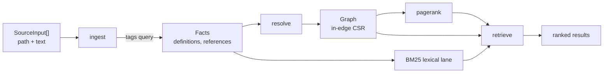

# workcell-code-graph

`workcell-code-graph` is the protocol-neutral engine behind Workcell's repository-scale code tools.
It takes source text that someone else read and returns a ranked, queryable symbol graph. It has no
filesystem access, no protocol dependency, and no notion of a tool call.

The MCP-facing group lives in `workcell-mcp-code-graph`, which owns confinement, crawling, tool
schemas, and result shaping. Everything below the crawl lives here.

## Pipeline

- **`extract`** parses one file and runs its `tags.scm`, then drops the tree. A whole-repository
  parse that retained trees would not fit any bound worth committing to.
- **`ingest`** assembles the fact tables, assigning file and node ids from sorted paths so a map is
  reproducible across machines whatever order the filesystem enumerated in.
- **`resolve`** turns a reference name into an edge through a fixed ladder: same file, then same
  directory, then whole tree. A name that still matches several definitions splits its weight `1/k`
  and is counted as ambiguous rather than guessed at.
- **`rank`** is personalized PageRank over the in-edge graph, plus `reaching_hops` for shortest-path
  distance from a seed set.
- **`retrieve`** fuses a BM25 lexical lane with the graph lane by reciprocal rank. A lane with no
  opinion casts no vote, which is why there is no lane-weight constant to tune.
- **`cache`** retains per-file facts by content digest under an entry and byte ceiling.
- **`git`** (optional `git` feature) adds recency and churn signals through `gix`. The map is
  complete without them.

## What the graph is not

Call edges are recovered from source text by name. Dynamic dispatch, callbacks, function pointers,
trait objects, reflection, and macro-generated call sites contribute no edge at all. Every count is
therefore a **floor**. A zero means "none found", never "none exists", and the tool layer states this
in a field rather than only in prose.

## Determinism

The same input must produce the same bytes on any machine. Four rules hold that:

1. Ids come from sorted paths, never from enumeration order.
2. Every ranking comparison breaks ties on a total order, never on float equality alone.
3. Iteration counts and convergence thresholds are fixed constants, never wall-clock or load
   dependent.
4. No ranking module may use a reassociating float operation. Rust has `f64::algebraic_add` and
   friends on stable, so this is a real hazard rather than a theoretical one, and
   `reassociating_float_operations_are_absent_from_every_ranking_module` scans the source to enforce
   it.

Extraction runs on a bounded worker pool. Worker count is a cost decision only: results are merged by
input position and cached in the same order, and `extraction_is_independent_of_worker_count` gates
that across the whole range a machine could report.

## Bounds

Every limit is host-owned and never accepted from model input: files per map, definitions and
references per file and per tree, source bytes, name and doc lengths, tree-walk depth, PageRank
iterations, cache entries and bytes, and extraction worker count. A bound that fires is named in the
result rather than applied in silence.
